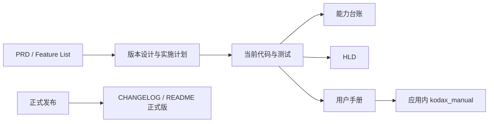

# KodaX Space 文档中心

> **2026-08-24 当前正式发布基线**：KodaX Space [`v0.1.45`](https://github.com/icetomoyo/KodaX-Space/releases/tag/v0.1.45)（package `0.1.45`）使用 npm
> Registry 的精确 KodaX `0.7.95` 包，要求 `conversationHistory:2`、`runtimeExitSettlement:2` 与
> `sandboxRuntime:5`；受管理的 Coder daemon 继续协商 `managedRunDurability:1`、
> `actorSettlementConvergence:2`、`sessionEventJournal:1` 与 `crashOutcomeModel:2`。Space 将 durable
> `runId`/`turnId` 绑定到 optimistic composer history，并按 Session/Run/Turn 因果身份与当前
> Session 的稳定拓扑串行化活动 Session 的输入准入与历史重验。同一 boot 的临时
> unconfirmed-owner 由 SDK 后台自动重试，Space 不要求用户删除标记。
> v0.1.45 还把 ask_user 与 guardrail 授权改为对话流内的聚焦提问卡（召回停靠条与队首卡
> 1-9/Enter/Esc 键盘操作），恢复 daemon 重连后已准入的 Runs，保证幂等发送只产生一个气泡。
> 未配置 Auto LLM timeout 时使用 SDK 首次 45 秒、重试 90 秒的默认值。
> root/Desktop manifest、lockfile、物理安装与打包 ASAR 必须解析到同一个正式 Registry URL/SRI。
> v0.1.44 / KodaX 0.7.93 及更早的发布记录保持历史事实。

> **2026-09-03 当前源码候选**：Space package 为 `0.1.46-alpha.3`，root/Desktop/lockfile 已精确锁定已发布的
> `@kodax-ai/kodax@0.7.96-alpha.7`。SDK 包门要求 `sandboxRuntime:11`、`runtimeAutoModeGuardrail:5`、`sharedSessionSettings:2` 与 `effectiveConfig:1`；daemon 准入与连接后 Runtime 门额外要求 `providerCredentialBroker:2`。Windows native protocol/setup generation 10、真实 target-start doctor 证明、私有逐命令 Temp 与 64 端口 broker 范围都由 v11 门隔离。KodaX
> universal native bundle 会整体解包，并在 packaged smoke 中按 manifest hash 校验；权限面仍为 Plan、Edits、Auto[LLM]、Full Access 四档；这不会
> 把 v0.1.45 / KodaX 0.7.95 的正式发布记录改写成 alpha 版本。

> 历史发布基线：KodaX Space [`v0.1.40`](https://github.com/icetomoyo/KodaX-Space/releases/tag/v0.1.40)（package `0.1.40`）/ npm 正式发布的精确 KodaX `0.7.86`；历史 release 文档继续保留当时事实。

这里是文档的统一入口。当前发布版的完整退出修复要求 Runtime 明确提供
`daemonOrphanExit:1`：
Coder 默认连接共享 daemon，并强制 compaction v3、transcript paging/search、
interrupt input、Actor/Turn v1 和 Auto LLM guardrail；Settings 可在无活动工作时
安全切换到 Embedded 兼容模式。生命周期能力按 daemon 实际返回值协商，不由
KodaX 版本号或 guardrail 版本推断。Partner 继续由 Space inline owner 管理，完整 F117/F118
桌面管理体验仍在后续路线中。历史设计和 release 记录保留当时语境。

当前发布版把底部“上下文窗口”改为按最终自动压缩阈值计算的有效窗口，并把模型最大上下文、自动压缩阈值、最近一次模型输入构成和距压缩剩余量分层展示；“会话 Token 用量”则独立累计根/子 Agent 的 Provider 调用与缓存分类。两者不能互换：前者是最近一次主模型请求的输入压力快照，后者是整个 Session 已发生的累计用量。v0.1.45 继续保留 v0.1.39 的多 Session 恢复、活动 Session 输入准入、历史分页、安全退出恢复隔离和 `(sessionId, journalEpoch, seq)` 水位隔离，并以正式 KodaX 0.7.95 的 sandbox v5 / crash outcome v2 门禁验证完整退出与 filesystem-effect 收敛。

KodaX 0.7.95 的配置说明也已收口：核心配置仍在 `~/.kodax/config.json`，MCP、可信 Extension 路径和 A2A 分别位于 `~/.kodax/integrations/mcp.json`、`extensions.json`、`a2a.json`。Settings → Runtime 会显示三个域的来源、revision、watcher、最近 reload 和有界诊断；Runtime 对无效更新保留 last-known-good 配置，并发写冲突要求 reload 后重试。应用内 `kodax_manual` 会继承当前安装 SDK 推荐的原始底层能力主题，再叠加 Space 操作说明。当前发布版 Coder 要求 `sandboxRuntime:5`、`conversationHistory:2`、`crashOutcomeModel:2`、`actorSettlementConvergence:2` 与 `sessionEventJournal:1`，并按 `(sessionId, journalEpoch, seq)` 隔离事件水位。

当前源码采用 KodaX 0.7.96 的 sandbox-first 环境契约：命令沙箱继承宿主环境，但固定的
KodaX/Electron 执行控制变量仍被阻止。旧 `sandbox.envPass` 输入已经失效，Space 不再提供
编辑入口，也不会把它投影到 Coder、Partner、legacy 或 Workflow Run。

## 我想要……

| 目标                                | 从这里开始                                                                                                                                                                |
| ----------------------------------- | ------------------------------------------------------------------------------------------------------------------------------------------------------------------------- |
| 安装、配置、第一次完成任务          | [用户使用手册](USER_MANUAL.zh-CN.md)                                                                                                                                      |
| 快速理解界面和功能                  | [用户使用手册：界面地图](USER_MANUAL.zh-CN.md#5-界面地图)                                                                                                                 |
| 理解上下文窗口与会话 Token 的区别   | [用户使用手册：上下文窗口与会话 Token](USER_MANUAL.zh-CN.md#52-上下文窗口与会话-token-用量)                                                                               |
| 理解当前 Runtime 所有权与安全门     | [用户使用手册：Runtime Host](USER_MANUAL.zh-CN.md#runtime-host)                                                                                                           |
| 理解 Windows 托盘与跨平台退出语义   | [用户使用手册：后台托盘](USER_MANUAL.zh-CN.md#windows-后台托盘与跨平台彻底退出)                                                                                           |
| 配置或迁移 MCP、Extensions、A2A     | [用户使用手册：MCP 与 .mcpb](USER_MANUAL.zh-CN.md#mcp-与-mcpb)                                                                                                            |
| 从源码运行、测试、打包              | [运行与开发指南](USAGE.md)                                                                                                                                                |
| 了解产品目标和边界                  | [PRD](PRD.md)                                                                                                                                                             |
| 理解进程、IPC、Runtime 和数据所有权 | [HLD](HLD.md)                                                                                                                                                             |
| 查看 KodaX 能力是否已接入           | [KodaX 能力台账](KODAX_CAPABILITY_LEDGER.md)                                                                                                                              |
| 查看当前和未来 Feature              | [Feature List](FEATURE_LIST.md)                                                                                                                                           |
| 查看 v0.1.31 的设计与实施           | [版本设计](features/v0.1.31.md) / [实施计划](features/v0.1.31-implementation-plan.md) / [人工测试指导](test-guides/FEATURE_116_v0.1.31_TEST_GUIDE.md)                     |
| 查看 v0.1.32 的设计与发布证据       | [版本设计与实施状态](features/v0.1.32.md) / [发布记录](releases/v0.1.32-release-readiness.md) / [Feature List](FEATURE_LIST.md)                                           |
| 查看 v0.1.33 的设计与发布证据       | [版本设计与实施状态](features/v0.1.33.md) / [发布记录](releases/v0.1.33-release-readiness.md) / [Feature List](FEATURE_LIST.md)                                           |
| 查看修正后 v0.1.33 的设计与人工验收 | [版本设计](features/v0.1.33.md) / [F141 人工测试指导](test-guides/FEATURE_141_v0.1.33_TEST_GUIDE.md) / [F142 人工测试指导](test-guides/FEATURE_142_v0.1.33_TEST_GUIDE.md) |
| 查看 v0.1.34 的设计与发布证据       | [Runtime 安全设计](features/v0.1.34.md) / [发布记录](releases/v0.1.34-release-readiness.md) / [Feature List](FEATURE_LIST.md)                                             |
| 查看 v0.1.61 文档 Skill 规划        | [F137/F139 设计](features/v0.1.61.md)                                                                                                                                     |
| 查看 post-v0.5.x OS 沙箱补强规划    | [F138 原生文档/工具 OS 沙箱设计](features/v0.5.x-plus.md)                                                                                                                 |
| 维护或更新 Space builtin skills     | [Builtin skill 维护说明](BUILTIN_SKILLS.md)                                                                                                                               |
| 报告或核对已知问题                  | [Known Issues](KNOWN_ISSUES.md) / [已归档问题](ISSUES_ARCHIVED.md)                                                                                                        |
| 参与贡献                            | [Contributing](../CONTRIBUTING.md)                                                                                                                                        |

## 当前有效文档

| 文档                                                 | 性质                          | 更新规则                                                                 |
| ---------------------------------------------------- | ----------------------------- | ------------------------------------------------------------------------ |
| `README.md` / `README_CN.md`                         | 项目入口                      | 只概括公开版本和下一开发基线                                             |
| `USER_MANUAL.zh-CN.md`                               | 面向用户                      | 必须与当前 UI、快捷键和实际能力一致                                      |
| `USAGE.md`                                           | 面向开发/运维                 | 必须与 package scripts、数据路径和验证流程一致                           |
| `PRD.md`                                             | 产品目标与路线                | 保留长期方向，明确已交付/开发中/观察项                                   |
| `HLD.md`                                             | 当前高层架构                  | 反映真实 owner、边界和降级策略                                           |
| `KODAX_CAPABILITY_LEDGER.md`                         | 能力接入事实                  | 每次 SDK/Runtime 接入后更新状态与证据                                    |
| `FEATURE_LIST.md`                                    | 版本路线图                    | 只有可交付、可验证的版本项进入 active list                               |
| `KNOWN_ISSUES.md`                                    | 当前问题                      | 已解决项保留结论，新增问题需有复现和状态                                 |
| `BUILTIN_SKILLS.md`                                  | builtin 分发维护              | 固定来源、许可、补丁、更新和打包完整性                                   |
| `features/v0.1.45.md`                                | current release design        | Inline ask-user conversation cards and exact KodaX 0.7.95 boundary       |
| `releases/v0.1.45-release-readiness.md`              | current release record        | Gates, GitHub CI, artifact evidence, and regression items                |
| `test-guides/ISSUE_193_v0.1.45_REGRESSION_GUIDE.md`  | current regression acceptance | Causal conversation order and Ctrl+R sidecar/interrupt recovery          |
| `test-guides/ISSUE_196_v0.1.45_REGRESSION_GUIDE.md`  | current regression acceptance | Live history, queue ordering, loading, status, and compaction feedback   |
| `test-guides/ISSUE_197_v0.1.45_REGRESSION_GUIDE.md`  | current regression acceptance | Proxy-aware build gate and shutdown-cancelled startup recovery           |
| `features/v0.1.44.md`                                | 历史 release 设计             | Native attention, background settlement, and exact KodaX 0.7.93 boundary |
| `releases/v0.1.44-release-readiness.md`              | 历史发布记录                  | Gates, GitHub CI, artifact evidence, and regression items                |
| `test-guides/FEATURE_145_v0.1.44_TEST_GUIDE.md`      | 历史回归验收                  | Cross-platform native attention badge                                    |
| `test-guides/ISSUE_189_v0.1.44_REGRESSION_GUIDE.md`  | 历史回归验收                  | Background complete-exit settlement                                      |
| `test-guides/ISSUE_190_v0.1.44_REGRESSION_GUIDE.md`  | 历史回归验收                  | Previous-boot Windows ACL recovery                                       |
| `test-guides/ISSUE_191_v0.1.44_REGRESSION_GUIDE.md`  | 历史回归验收                  | External-task empty and recoverable-error states                         |
| `test-guides/ISSUE_192_v0.1.44_REGRESSION_GUIDE.md`  | 历史回归验收                  | Quiet ordinary safe exit                                                 |
| `features/v0.1.43.md`                                | 历史 release 设计             | Runtime exit, KodaX 0.7.92, sandbox v4, and release boundary             |
| `releases/v0.1.43-release-readiness.md`              | 历史发布记录                  | Gates, GitHub CI, artifact evidence, and regression items                |
| `test-guides/ISSUE_188_v0.1.43_REGRESSION_GUIDE.md`  | 历史回归验收                  | Complete-exit settlement and recovery                                    |
| `test-guides/ISSUE_256_v0.1.43_REGRESSION_GUIDE.md`  | 历史回归验收                  | sandbox v4 / crash-outcome v2 filesystem-effect convergence              |
| `features/v0.1.42.md`                                | 历史 release 设计             | Causal transcript, latest KodaX 0.7.89, and release boundary             |
| `releases/v0.1.42-release-readiness.md`              | 历史发布记录                  | Gates, GitHub CI, artifact evidence, and regression items                |
| `test-guides/ISSUE_182_v0.1.42_REGRESSION_GUIDE.md`  | 历史回归验收                  | Canonical/live ordering and exact owner reconciliation                   |
| `test-guides/ISSUE_183_v0.1.42_REGRESSION_GUIDE.md`  | 历史回归验收                  | Terminal owner reconciliation and exact-once folding                     |
| `test-guides/ISSUE_184_v0.1.42_REGRESSION_GUIDE.md`  | 历史回归验收                  | Continued-Run turn projection and compaction boundary                    |
| `test-guides/ISSUE_185_v0.1.42_REGRESSION_GUIDE.md`  | 历史回归验收                  | Completion notification and Actor settlement v2                          |
| `features/v0.1.40.md`                                | 历史 release 设计             | KodaX 0.7.86、sandbox v3、owner reconciliation 与发布边界                |
| `releases/v0.1.40-release-readiness.md`              | 历史发布记录                  | 门禁、GitHub CI、产物证据和人工项                                        |
| `features/v0.1.39.md`                                | 历史 release 设计             | KodaX 0.7.85、Actor convergence、journal epoch 与发布边界                |
| `releases/v0.1.39-release-readiness.md`              | 历史发布记录                  | 门禁、GitHub CI、产物证据和人工项                                        |
| `features/v0.1.38.md`                                | 历史 release 设计             | KodaX 0.7.84、Session reactivation 与发布边界                            |
| `releases/v0.1.38-release-readiness.md`              | 历史发布记录                  | 门禁、GitHub CI、产物证据和发布资产                                      |
| `releases/v0.1.37-release-readiness.md`              | 历史发布记录                  | 保留 v0.1.37 门禁、GitHub CI、产物证据和人工项                           |
| `releases/v0.1.35-release-readiness.md`              | 历史发布记录                  | 保留已发布版本的门禁、产物哈希和人工项                                   |
| `test-guides/ISSUE_128_v0.1.40_REGRESSION_GUIDE.md`  | 历史回归验收                  | 覆盖 sandbox v3、打包 Windows Shell 和重启链路                           |
| `test-guides/ISSUE_178_v0.1.39_REGRESSION_GUIDE.md`  | 历史回归验收                  | 覆盖 unknown Run、精确 Stop、journal epoch 和输入去重                    |
| `test-guides/ISSUE_176_v0.1.38_REGRESSION_GUIDE.md`  | 历史回归验收                  | 覆盖 Session 重新激活、canonical 去重和跨 Session 隔离                   |
| `test-guides/ISSUE_175_v0.1.37_REGRESSION_GUIDE.md`  | 历史回归验收                  | 覆盖安全退出、daemon 恢复和多 Session 隔离                               |
| `test-guides/FEATURE_141_v0.1.33_TEST_GUIDE.md`      | 当前人工验收                  | 覆盖两种 owner、双向切换、打包闭包和真实启动                             |
| `test-guides/FEATURE_142_v0.1.33_TEST_GUIDE.md`      | 当前人工验收                  | 覆盖会话文件路径的共享文件动作                                           |
| `apps/desktop/electron/kodax/space-manual-topics.ts` | 应用内 AI 自说明              | 与用户手册同步更新，防止 AI 给出旧操作说明                               |

## 历史文档

以下文档是历史证据，不按当前 UI 重写：

- `CHANGELOG.md`：已发布版本的变更记录；
- `features/v*.md`：对应版本当时的目标、决策和验收；
- `ADR/`：架构决策及其 superseded/rejected 状态；
- `FEATURES_ARCHIVED.md`：已经交付、取消或进入 watchlist 的 Feature；
- `ISSUES_ARCHIVED.md`：超过 30 天且已解决问题的完整调查证据；
- `docs/known-issues/`：具体问题的调查与修复记录。

阅读历史文档时，请以文档日期和版本为准，不要用它判断当前 UI。当前事实优先看用户手册、HLD、能力台账和 Feature List。

## 文档与实现的关系

文档不能仅依据计划声称“已支持”。只有代码路径、自动化测试和必要人工验收都满足后，能力台账才能标为 `supported`；只有发布完成后，README/CHANGELOG 才能把它写成公开正式版。

## 更新检查清单

涉及用户可见能力、Runtime/SDK 边界或版本状态的改动，至少检查：

1. 用户手册是否说明入口、效果、限制和风险；
2. `space-manual-topics.ts` 是否给 AI 相同答案；
3. PRD/HLD/能力台账的 owner 和状态是否一致；
4. Feature List、版本设计、测试指导是否能互相链接；
5. README 是否仍准确区分开发版与正式版；
6. Mermaid、相对链接、标题锚点和代码命令是否可用；
7. 发布后是否同步 CHANGELOG、版本号和 release links。
