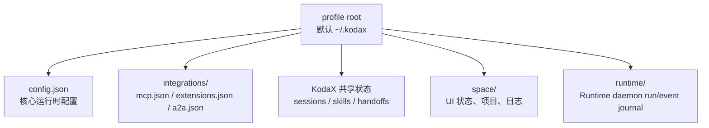
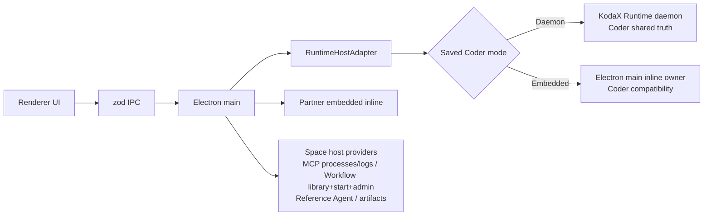

# KodaX Space 运行与开发指南

> **当前发布基线（2026-08-24）**：KodaX Space `v0.1.45` / npm Registry KodaX `0.7.95`。
> Space 管理的 daemon 需要 `managedRunDurability:1`：接受的首条/队列输入及完成回合
> 在生命周期事件前持久化为 canonical Run。Space 绑定确认的 `runId` 和流式 `turnId`，不以版本号代替能力协商。
> 未显式设置 Auto LLM timeout 时，SDK 使用首次 `45000ms`、重试 `90000ms`。
> v0.1.45 的 root/Desktop/lockfile 精确锁定 npm Registry KodaX `0.7.95` 正式包及其 SRI，并要求
> SDK 与 daemon 提供 `sandboxRuntime:5`、`crashOutcomeModel:2`、`conversationHistory:2` 和 `actorSettlementConvergence:2`；Space 还保持精确
> Session/Run/Turn owner 关联和 continued-Run history/live 边界。完整退出使用 SDK 本地
> `runtimeExitSettlement:2`，同一 boot 的暂时性 owner 验证由 SDK 与 Space 自动重试，不把版本号当作运行时能力证明。

> 面向源码使用者、贡献者和发布维护者。普通用户请阅读[用户使用手册](USER_MANUAL.zh-CN.md)。
>
> 当前 `main` 对 Space 管理的 daemon 要求专用的 `daemonOrphanExit:1` 能力；
> 不使用 KodaX 语义版本或 Auto-mode guardrail 版本代替生命周期能力判断。
> 当前已发布版本为 KodaX Space [`v0.1.45`](https://github.com/icetomoyo/KodaX-Space/releases/tag/v0.1.45) / 精确 Registry KodaX `0.7.95`。
> 本版本把 ask_user 与 guardrail 授权改为对话流内的聚焦提问卡（全屏模态移除，召回停靠条与队首卡 1-9/Enter/Esc 键盘操作），对齐 `conversationHistory:2`、`runtimeExitSettlement:2` 与 `sandboxRuntime:5`，并恢复 daemon 重连后已准入的 Runs、保证幂等发送只产生一个气泡；同时保留 v0.1.44 的 F145 原生 Session 角标、后台 complete-exit settlement、安静的普通成功退出、previous-boot Windows ACL 恢复指引与 canonical page-head、Task Dock、Repointel、外部任务恢复态对齐，以及 crash-resumable exit、crash-outcome v2、SDK 有效输出 segment 和既有多 Session/Actor/Turn 安全边界。
>
> 当前源码候选为 Space `0.1.46-alpha.3`，精确锁定 KodaX `0.7.96-alpha.7` / `sandboxRuntime:11` / `runtimeAutoModeGuardrail:5` / `sharedSessionSettings:2` / `providerCredentialBroker:2` / `effectiveConfig:1`。Alpha.6/alpha.7 把 Windows native protocol/setup 提升到 generation 10，显式 doctor/setup 会证明一次真实 target start/exit，宽 profile ACL 仅由 setup 收敛，逐命令使用私有 Temp，网络 broker 扩到 64 端口，并继续安全替换空闲旧 daemon。
> 打包必须整体解包 `@kodax-ai/kodax/dist/native`；发布检查会验证 universal native
> 文件集合和 manifest hash，再运行真实 sandbox smoke。正式 v0.1.45 说明仍对应 KodaX 0.7.95。

## 1. 环境要求

- Node.js 22.12+（项目通过 `.nvmrc` 固定到 22.23.1，CI 读取同一文件）。
- npm 10+。
- Windows、macOS 或 Linux 桌面环境。
- 安装 native dependencies 所需的系统构建工具；Windows 通常需要 Visual Studio Build Tools。

```bash
git clone https://github.com/icetomoyo/KodaX-Space.git
cd KodaX-Space
npm install --include=dev
```

KodaX Space 是 npm workspace monorepo。不要只在 `apps/desktop` 中安装依赖，否则 workspace package、Electron native module 与根脚本可能不一致。

根、desktop manifest 与 lockfile 记录一个精确的 KodaX 版本。常规 Release/CI 使用
Registry 包；预发布测试可在 lockfile 中解析到仓库内带版本号的 vendor tgz，并固定其
sha512 完整性，通过 `npm run build:test-kodax` 显式构建。开发联调可用
`npm run link:kodax` 连接同级源码；打包沿用既有依赖一致性检查，
要求两个 manifest、lockfile 与安装包解析同一个版本和完整性，不再增加
“KodaX 必须 ≥0.7.78”或包元数据生命周期门禁。Runtime 连接按实际能力协商：
Space 管理的 daemon 必须返回 `daemonOrphanExit:1`，并继续要求
`permission:grant-admin`、`interruptInput:1`、`actorControlPlane:1`、
`contextCompaction:3`、`transcriptPaging:1`、`transcriptSearch:1`、
`skillLearningLoop:1`、`integrationConfigResilience:1` 和
`runtimeAutoModeGuardrail:4`、`actorSettlementConvergence:2`。`@kodax-ai/kodax/sandbox` 通过独立 facade probe
验证，不能用版本号冒充 backend readiness。不得伪造 lockfile URL/SRI；本地测试包必须
使用 `kodax-ai-kodax-<version>.tgz` 命名、随 checkout 提供，并由 lockfile SRI 锁定内容。
普通 `npm run build` 和正式发布入口始终拒绝本地 tgz。

## 2. 启动方式

### 2.1 开发模式

```bash
npm run dev
```

该命令协调 Vite renderer、Electron main watch、native dependency ABI 和桌面进程。需要调试界面时优先使用它，不要分别手工启动多个子进程。

### 2.2 正式安装包

普通用户从 [GitHub Releases](https://github.com/icetomoyo/KodaX-Space/releases/latest) 获取安装包：

| 平台    | 产物                        |
| ------- | --------------------------- |
| Windows | NSIS Setup、Portable、zip   |
| macOS   | universal dmg，或按架构构建 |
| Linux   | AppImage、deb               |

当前公开构建未经过面向公众的系统签名渠道，首次启动可能需要在 SmartScreen 或 Gatekeeper 中确认可信来源。

## 3. 配置与数据目录



| 路径或变量                               | 作用                                                           | 说明                                                                                        |
| ---------------------------------------- | -------------------------------------------------------------- | ------------------------------------------------------------------------------------------- |
| `~/.kodax/config.json`                   | Provider、permission、compaction 等核心配置                    | CLI/SDK/Space 共用；旧 Auto engine/timing 与 `sandbox.envPass` 输入已失效；不再把 MCP/A2A/Extension 当作新写入字段 |
| `~/.kodax/integrations/mcp.json`         | 用户 MCP server 声明                                           | 严格 `version: 1` + `servers`；CLI/SDK/Space 共用                                           |
| `~/.kodax/integrations/extensions.json`  | 受管理 Extension 路径                                          | 严格 `version: 1` + `paths`；Space 加载仍需 `KODAX_SPACE_ENABLE_SDK_EXTENSIONS=1`           |
| `~/.kodax/integrations/a2a.json`         | Runtime A2A registration                                       | 由 KodaX Runtime 持有                                                                       |
| `<project>/.kodax/integrations/mcp.json` | 项目 MCP 覆盖                                                  | Space 项目兼容层；同名项目 server 优先                                                      |
| `~/.kodax/sessions/`                     | 会话历史                                                       | CLI/SDK/Space 共用                                                                          |
| `~/.kodax/skills/`                       | 用户 Skills                                                    | 项目也可有项目级 Skills                                                                     |
| `~/.kodax/handoffs/`                     | 桌面 handoff inbox                                             | 用于上下文连续性                                                                            |
| `~/.kodax/space/`                        | Space UI 和桌面专属状态                                        | 包含 logs、state 等                                                                         |
| `~/.kodax/space/settings.json`           | Space versioned preferences                                    | version 3 保存 `coderRuntimeMode`；不属于 KodaX 核心配置或 integrations                     |
| `<profile-root>/runtime/`                | Shared Runtime state/journal                                   | Coder daemon runs；默认实际为 `~/.kodax/runtime/`                                           |
| `KODAX_HOME=<abs>`                       | 改变 SDK 共享数据根                                            | 必须在应用启动前设置                                                                        |
| `KODAX_PROFILE_DIR=<abs>`                | 让 Space 和 SDK 使用一个独立 profile                           | 该绝对路径本身就是 profile 根，不再追加 `.kodax`                                            |
| `KODAX_TEST_ONBOARDING=1\|<safe-id>`     | 测试隔离 profile                                               | 强制写入系统临时目录，禁止指向真实用户数据                                                  |

若同时使用 `KODAX_PROFILE_DIR`，Space 会在首次加载 SDK 前将 `KODAX_HOME` 对齐到该 profile。相对路径会被忽略；测试模式优先级最高。

KodaX 0.7.96 的命令沙箱默认继承宿主环境，同时继续阻止固定的 KodaX/Electron 执行控制
变量。旧 `config.json#sandbox.envPass` 输入已经失效；Space 不再编辑、写入或向任何 Run
投影该字段。读取旧配置时只把它当迁移遗留，不恢复旧的环境 allow-list 语义。

沙箱诊断必须从 Settings → Runtime 的宿主控制面直接执行，或在宿主终端运行
`kodax sandbox doctor`；不要让模型通过 Bash 工具嵌套执行 doctor。Windows 受限账号按设计
不能读取宿主持有的 ASRT 状态，嵌套 doctor 因此不能代表机器级 readiness，也不应通过放宽
控制状态权限来“修复”。Space 启动、后台检查和普通工具调用不会自动请求 UAC；只有用户
显式确认 Setup 时才调用 SDK activation，完成后再以真实 target-start probe 验证结果。

从旧版升级时，`config.json#mcpServers` 与 `config.json#extensions` 仍可只读回退，但不应继续作为新配置位置。Settings → Runtime 会调用当前 KodaX SDK 的 `planLegacyIntegrationMigration()` 展示迁移计划，并通过 `migrateLegacyIntegrationConfig()` 提供“迁移集成配置”按钮；它只创建缺失文件，不覆盖已有目标，也不删除旧字段，成功后会重载 MCP。命令行也可先运行 `kodax integrations migrate` 查看计划，再运行 `kodax integrations migrate --apply` 创建独立文件；确认独立文件有效后，才使用 `kodax integrations migrate --apply --cleanup-legacy` 显式清理旧字段。A2A 没有旧 `config.json` 迁移源，始终以 `integrations/a2a.json` 为权威配置。

KodaX daemon watcher 对无效集成更新保留 last-known-good。Space 以有界周期读取
daemon management health，仅在健康指纹变化时刷新投影；损坏一个可选 integration
文件不会让 Coder 断线，修复文件后 Settings 通常会在数秒内自动恢复 healthy。轮询错误
只保留上一份健康状态并记录一次有界警告，不会把核心 Runtime 标记为不可用。

## 4. Runtime Host 与 Coder 模式选择

`RuntimeHostAdapter` 仍是 Electron main 内部的 owner/能力边界；客户只选择
**Daemon** 或 **Embedded**，不会看到 endpoint、token、owner revision、inline fence 或
内部 `runtime | legacy` 名称：



v0.1.33 的 Coder daemon 路由包括：

- session/run/transcript/live projection、compact/fork/rewind 与共享设置 CAS；
- queue、permission grant、AskUser 和 daemon stop preflight；
- Workflow list/get/event 与 pause/resume/stop；
- Learning Center 命令、Skill/slash catalog、MCP tool discovery/reload；
- Runtime 配置 External Agent 的发现、预检和统一 Actor/Turn 任务控制。
- compaction v3 的 durable-before-evict 边界、精确 checkpoint/recovery-guidance 活动 lineage，以及 revision-bound transcript page/chunk/search；
- mailbox-driven 模型协调；Space/SDK 的 Actor progress snapshot/replay/long-poll 保持遥测语义，不驱动父模型重复采样；
- idle-yield 恢复用户提示、未确认 root completion 的一次性恢复，以及 root/child live projection 隔离。
- PowerShell `-Path` 方括号通配符 fail-closed 升级确认，同时保留 `-LiteralPath`/`-PSPath` 的精确方括号文件名语义；
- KodaX CLI auto-resume 有界扫描并跳过空 ACP 占位会话；Space 继续使用自己的显式 Session 选择器。
- 交互式 resume 恢复 workspace runtime、messages、UI history、lineage、artifacts、extensions、title、tag 与 session identity；
- 权限档位统一为 Plan、Edits、Auto[LLM]、Full Access；旧 Auto Rules/engine/timing 设置只用于迁移并归一为 Auto[LLM]。Auto 沙箱优先，只有可证明的启动前宿主边界才进入固定 LLM reviewer；Full Access 直接执行但仍受 Exec Policy 约束；
- imperative manual compaction 先把精确 flat Session history 对齐进 lineage；durable interrupt-delivery 持久化失败时输入保持 queued，并只发出不含用户正文的有界 warning。
- `contextDiagnostics` 只投影根上下文分类 Token 数；Renderer 以最终自动压缩阈值为有效分母，并把模型最大上下文作为独立事实。Provider 根计数优先，budget fallback 会减去 reserved response capacity。
- KodaX 0.7.77 的完成态 hash-only cache diagnostic 是 Session usage 的权威物理调用源，按 `requestId` 去重并覆盖 root/child、retry、fallback、repair、workflow digest 与 compaction summary；`iteration_end.usage` 仅是旧 Runtime/mock 在诊断激活前的回退。

以下仍由 Space 管理：renderer 投影、Partner profile/tools/policy、Workflow library/start/rerun/save/admin/result/artifact、MCP server 进程与日志、Artifact 和 Space Reference Agent durable store。不要把这些路径写成 Runtime-native。

Coder 缺少必要 Runtime capability 时 fail closed，不会把已接受操作偷偷重放到 inline owner。
Partner 始终保持 embedded-inline。F141 在 **Settings → Runtime → Coder 运行模式** 提供
客户可见的 Daemon / Embedded 选择：

- **Daemon（推荐）**：连接共享 Runtime，保留持久任务、重连和多客户端协同能力；
- **Embedded（兼容模式）**：在 Space 进程内持有 Coder，Daemon 无法正常启动或连接时可切换到此模式继续使用；
- 切换会同步关闭 Coder admission，等待已经进入的 Session、Slash、Workflow、
  Runtime External Agent、MCP 和 Runtime-affecting Settings 操作退出，再检查活动状态；
- 只有 ManagedSession、running/paused Workflow、非终态 External Agent task、待处理
  permission/AskUser 和待派发 Coder queue 都为空时才能切换；daemon 的 active/queued
  work 或其他客户端也会阻止切换；通过所有权安全检查后，Space 保存偏好并自动重启；
- Daemon → Embedded 会先安全停止空闲 daemon 并取得 inline owner；若还有任务、交互、其他客户端或所有权不可确认，切换会被拒绝；
- Embedded → Daemon 会先释放 inline owner 并恢复 daemon owner policy。中途失败会尝试补偿；如果无法证明任一 owner 仍可用，Space 会保持 Coder 入口关闭并执行恢复重启。
- 新进程会在 Runtime connect 之前协调持久化偏好和 owner policy：Daemon 偏好遇到
  unowned inline policy 会先恢复 daemon policy；active/unreadable inline owner 会
  fail closed，避免崩溃窗口产生双 owner。

偏好保存在 `~/.kodax/space/settings.json`。旧的
`KODAX_SPACE_RUNTIME_HOST=legacy|runtime` 只在旧版/空设置迁移时作为初始值；一旦
首次模式选定，Space 会原子创建 version 3 设置；之后 Settings 中的选择就是启动真理，
不再由环境变量覆盖。

MCP、A2A 或 Extensions 的独立配置文件若校验失败，Space 报告 SDK/Runtime 错误和对应的
规范路径，不删除、重写或静默重置配置。修复点名文件后执行相应 reload；涉及 inbound
A2A authentication/authority 的变化仍可能要求 Runtime owner 安全重启。

### Windows 后台托盘与跨平台退出

Windows 默认启用后台托盘。F140 让主窗口关闭行为可在 Settings → Preferences 中设为
每次询问、最小化到托盘并保留 Runtime，或请求彻底退出；首次关闭默认询问，
并可记住选择。最小化到托盘会销毁 BrowserWindow/renderer，但保留轻量 Electron
main、托盘和 Runtime 客户端连接。托盘可重建窗口、只关闭界面，或请求安全的彻底退出；
不再提供会让 Space 自动拉起的 daemon 失去可见控制面的“仅退出 Space”动作。

Windows 彻底退出、macOS `Cmd+Q` 和 Linux 最后窗口退出使用同一生命周期：先关闭
Coder admission 并检查 blocker，再尝试 Runtime 的安全停止。active/queued/pending 工作
或其他客户端阻止安全停止时，对话框提供“保持 Space 开启”和“强行关闭”；关闭对话框
等同保持开启。强行关闭会取消当前 Space 所属的 Session Run、Agent Turn、Workflow、
外部 Agent、交互与排队输入，然后完全退出 Electron；其他客户端的任务及其 Runtime
不会被停止。共享 Runtime 的取消依据已认证的 Space principal、精确 Run/Agent ID 和
Workflow source Run，不把 Session ID 当作客户端所有权。安全准备失败时也会提供相同
的两个选项；取消、daemon 停止或最终清理即使未在有界等待内确认，也不会再次弹窗或
重新拉起 Space。自动化 fixture 可设置
`SPACE_DISABLE_TRAY=1` 获得确定性的关闭即退出行为；这不是 renderer 可写的产品偏好。
若托盘初始化失败，应用仍走相同的 complete-exit gate。

`daemonOrphanExit:1` 仅对 Space 新拉起的 daemon 启用 30 秒 orphan idle-exit。
最后一个客户端异常断开后，daemon 在没有其他客户端且任务空闲时自停；仍有任务则等到终态后重试。
旧版残留优先执行 `kodax daemon stop --profile coder --timeout-ms 10000 --json`。CLI
不可用时从 `${KODAX_HOME:-~/.kodax}/runtime/daemon/coder/daemon.json` 读取 PID，
用 `ps` 核验 `daemon serve --profile coder` 后发送 `kill -TERM <PID>`；不要按共享
进程名执行 `killall`。

Settings → Preferences 的 Terminal Shell 选择会同时作用于 Space PTY 与 Coder
命令工具。Electron main 从选中 shell 的登录环境解析 `PATH`，剥离常见密钥变量后再
建立执行环境；若 shell 不可用则显示明确诊断，不静默切到不同的执行语义。

## 5. 常用开发命令

| 目标                        | 命令                                        |
| --------------------------- | ------------------------------------------- |
| 启动开发环境                | `npm run dev`                               |
| 类型检查                    | `npm run typecheck`                         |
| Lint                        | `npm run lint`                              |
| 全量单元/集成测试           | `npm test`                                  |
| Desktop 单元测试            | `npm test -w @kodax-space/desktop`          |
| IPC schema 测试             | `npm test -w @kodax-space/space-ipc-schema` |
| 构建 renderer/main/packages | `npm run build:smoke`                       |
| Playwright E2E              | `npm run e2e`                               |
| 有界面 E2E                  | `npm run e2e:headed`                        |
| 校验 builtin skill 来源锁   | `npm run skills:check`                      |
| 从审定上游更新 builtin      | `npm run skills:update`                     |
| 打包产物检查                | `npm run smoke:pack`                        |
| packaged boot smoke         | `npm run smoke:boot`                        |

建议提交前按下面顺序执行：

```bash
npm run typecheck
npm run lint
npm test
npm run e2e
npm run build:smoke
```

高风险的 main/IPC/session/runtime 改动还应执行对应人工测试指导，例如 [v0.1.31 测试指导](test-guides/FEATURE_116_v0.1.31_TEST_GUIDE.md)。

Space 自有 builtin skill 的来源、许可证、补丁和逐文件哈希由
`resources/builtin-skills.sources.json`、`resources/builtin-skill-patches/` 与
`resources/builtin-skills.lock.json` 共同固定。正常更新必须使用 `npm run skills:update`，
审阅完整 diff 后再执行 `npm run skills:check`；不要直接修改生成的
`resources/builtin-skills/`。完整流程见 [builtin skill 维护说明](BUILTIN_SKILLS.md)。

## 6. Native module ABI

Desktop 单元测试需要 Node ABI，Electron 启动与 E2E 需要 Electron ABI。项目脚本会自动调用：

```bash
node scripts/ensure-sqlite-native.mjs node
node scripts/ensure-sqlite-native.mjs electron
```

不要并行运行会把同一个 native module 重建成不同 ABI 的测试/构建任务。典型症状是 `better-sqlite3` 或其他 native addon 报 `NODE_MODULE_VERSION` 不匹配。出现时，停止并行进程，再通过目标命令让脚本重建到正确 ABI。

`.npmrc` 启用 `engine-strict`，因此低于 Node 22.12 的安装会直接失败。Electron 与
electron-builder 二进制下载使用项目配置的镜像；若组织网络要求自建镜像，请在受控 CI
环境中覆盖对应 npm 配置，不要提交临时开发机路径。

## 7. 构建与打包

```bash
npm run build:win
npm run build:mac
npm run build:linux
```

跨平台产物最好在对应系统或 CI runner 上生成。发布前至少确认：

1. 根/desktop `package.json`、两份 lock 视图、已安装 KodaX、应用 Version IPC、CHANGELOG 和 feature doc 版本一致，且 SDK 解析为带 Registry URL/SRI 的同一个精确正式版本；
2. `npm run build:smoke` 通过；
3. pack 自动导入所有 KodaX public facade，按 Node ancestor 规则验证完整传递依赖，确认
   `app.asar.unpacked` 中的 native SQLite，并实际加载 `better-sqlite3`；
4. `npm run skills:check` 通过，打包后的 Space builtin 文件集/字节与 lock 完全一致，Huashu 三个有序补丁及大小写不敏感的推广签名禁词门禁有效，SDK builtin Markdown 也仍在 `app.asar`；
5. Provider、创建会话、发送消息、后台 Session 权限/AskUser、session restore、fork/rewind/compact 完成人工冒烟；
6. Windows 本地产物由 pack 自动运行真实 `win-unpacked/KodaX Space.exe` boot smoke，
   CI 的 Windows/macOS/Linux 产物均通过对应 package/boot smoke；
7. Windows 人工验证主/Artifact 窗口图标、托盘关闭/重开/两种退出语义，以及重复查询时不出现瞬时 console 窗口；KodaX 0.7.77 保留非交互子进程隐藏，任何重现都按回归处理；
8. 正式发布后再把文档中的“开发基线”改成“公开正式版”。

当前源码使用 `electron-builder@26.15.3` 和 `node-gyp@12.2.0`，Windows CI 可运行在
`windows-latest` 的 Visual Studio 2026 工具链上。`afterPack` 通过固定的
`resedit@1.7.2` 直接修改 PE icon/version resources，不再扫描或启动缓存中的
`rcedit.exe`。相关依赖和资源门禁失败必须让安装/打包失败，不能用 `|| true` 吞掉。

正式 `build:pack` 会下载 lockfile 锁定的 KodaX Registry tarball 并校验 URL、SRI 与安装
字节。当前源码通过 `EnvHttpProxyAgent` 读取标准代理环境；代理凭据不会写入日志。下载和
dispatcher teardown 都有界，超时或非法 URL 会明确失败并结束进程。如果构建停在
`scripts/pack.mjs`，先核对 `HTTPS_PROXY`/`NO_PROXY` 和 Registry 连通性，再运行
`npm run test:release`；不要用扩大超时或跳过完整性校验掩盖网络问题。

[v0.1.45 发布记录](releases/v0.1.45-release-readiness.md)是当前正式版证据的真理源；历史
[v0.1.44 发布记录](releases/v0.1.44-release-readiness.md)与
[v0.1.34 发布记录](releases/v0.1.34-release-readiness.md)等继续保留当时事实。v0.1.45 已通过
精确 Registry 依赖一致性、`conversationHistory:2`/`runtimeExitSettlement:2`/`sandboxRuntime:5` 契约、完整依赖闭包、
native SQLite load、物理 sandbox helper/doctor、真实 packaged boot 和 GitHub CI 门禁后
发布。

## 8. 排障

| 现象                          | 首先检查                                                                                                                 |
| ----------------------------- | ------------------------------------------------------------------------------------------------------------------------ |
| 没有 Provider / API key       | Settings → Providers；环境变量；OS Keychain 状态                                                                         |
| 会话或配置出现在错误 profile  | 启动前的 `KODAX_HOME`、`KODAX_PROFILE_DIR`；不要在 SDK import 后修改                                                     |
| Runtime run 失败              | 版本信息、runId、`~/.kodax/space/logs`、Runtime status/capability snapshot                                               |
| Packaged daemon 启动即退出    | `~/.kodax/space/logs`；必要时把 `scripts/diagnose-packaged-daemon.cmd` 复制到 extracted app 目录前台复现                 |
| MCP 工具不可见                | MCP panel 的 Refresh/Reload、server diagnostics；MCP 子进程由 Space 管理                                                 |
| ASRT 显示需要设置或不可用     | Settings → Runtime → 命令沙箱（ASRT）先刷新 doctor；Windows 按显式确认完成一次性设置，macOS/Linux 按指引安装依赖后再刷新 |
| E2E 启动失败且提到 native ABI | 结束并行测试，运行 `node scripts/ensure-sqlite-native.mjs electron`                                                      |
| Node 单测提到 native ABI      | 运行 `node scripts/ensure-sqlite-native.mjs node`                                                                        |
| UI 状态损坏                   | 先备份 `~/.kodax/space/`，检查日志；最后手段才重置 `state.json`                                                          |

提交问题时请包含版本、操作系统、复现步骤、是否使用独立 profile、相关日志和脱敏截图。已知问题见 [KNOWN_ISSUES.md](KNOWN_ISSUES.md)。

`scripts/diagnose-packaged-daemon.cmd` 不改变已保存的 Daemon/Embedded 偏好，会按当前
`KODAX_PROFILE_DIR`/`KODAX_HOME` 前台启动与正式包相同的 Electron→Node→KodaX CLI
链路，并在应用目录生成 `kodax-daemon-bootstrap-diagnostic.log`。该日志可能含本机路径、
profile 位置和 Runtime 错误；分享前必须人工脱敏。

## 9. 文档入口

- [文档中心](README.md)
- [用户使用手册](USER_MANUAL.zh-CN.md)
- [产品需求文档](PRD.md)
- [高层设计](HLD.md)
- [KodaX 能力台账](KODAX_CAPABILITY_LEDGER.md)
- [Feature 路线图](FEATURE_LIST.md)
- [Builtin skill 维护说明](BUILTIN_SKILLS.md)
- [v0.1.34 发布就绪清单](releases/v0.1.34-release-readiness.md)
- [v0.1.33 发布就绪清单](releases/v0.1.33-release-readiness.md)
- [v0.1.33 F141 人工测试指导](test-guides/FEATURE_141_v0.1.33_TEST_GUIDE.md)
- [v0.1.33 F142 人工测试指导](test-guides/FEATURE_142_v0.1.33_TEST_GUIDE.md)
- [贡献指南](../CONTRIBUTING.md)
