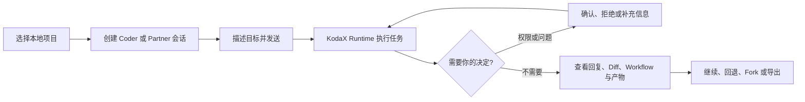
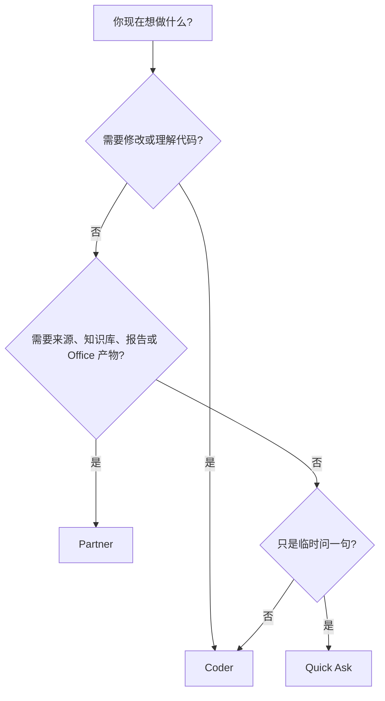
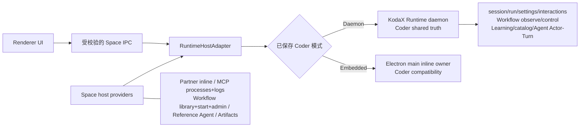
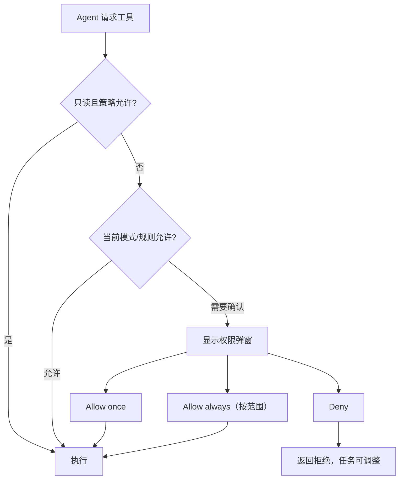
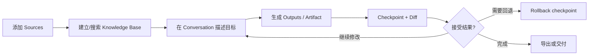
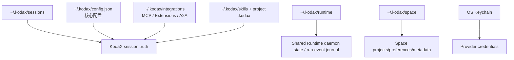

# KodaX Space 用户使用手册

<p align="center">
  
</p>

> 当前发布精确锁定 KodaX `0.7.95`，要求 `conversationHistory:2`、`runtimeExitSettlement:2` 与 `sandboxRuntime:5`。同一 boot 的临时 `unconfirmed-owner` 会自动重试；Space 不要求用户删除标记，且只在缺少安全证明时阻断有竞争风险的 sandbox/owner 操作。
>
> 当前源码候选为 Space `0.1.46-alpha.3`，精确锁定 KodaX `0.7.96-alpha.7`，并要求 `sandboxRuntime:11`、`runtimeAutoModeGuardrail:5`、`sharedSessionSettings:2`、`providerCredentialBroker:2` 与 `effectiveConfig:1`。
> Windows 既有安装首次迁移可能需要用户在 Settings → Runtime 明确执行一次 Sandbox Setup；
> 普通启动、Refresh 和工具调用不会隐式提升权限。正式发布版的 0.7.95 说明保留为历史事实。
>
> 已发布产品基线：KodaX Space [`v0.1.45`](https://github.com/icetomoyo/KodaX-Space/releases/tag/v0.1.45)（package `0.1.45`）/ npm 正式发布的精确 KodaX `0.7.95`。ask_user 与 guardrail 授权以对话流内的聚焦提问卡呈现：全部待答卡并存可答，composer 上方有带计数与定位闪光的召回停靠条，队首卡支持 1-9/Enter/Esc 键盘操作，对话历史保持可滚动。
>
> 上一代已发布基线 `v0.1.44` 使用精确 Registry KodaX `0.7.93`，要求 `sandboxRuntime:4`、
> `crashOutcomeModel:2`、`actorSettlementConvergence:2`、`sessionEventJournal:1`、
> `liveOutputSegments:1`、本地 `runtimeExitSettlement:1` 以及专用的
> `daemonOrphanExit:1` 能力，不通过 KodaX 版本号推断生命周期支持。F141 Coder
> Daemon/Embedded 客户开关、F142 会话文件操作和打包可靠性修复继续保留。
>
> 旧能力 SDK/daemon 会 fail closed，不能继续执行 Coder。Runtime 的合法排队等待、
> canonical replacement 和提交后维护失败会保持不同的可诊断事实。
>
> 更新日期：2026-08-28
>
> 如果你的界面与本文不同，请先在 Settings → License/版本信息中确认构建版本。
> 本手册对应 `v0.1.45` 正式发布产物；历史安装包的界面与行为可能不同。

这份手册面向第一次使用 KodaX Space 的开发者、技术团队成员和代码相关知识工作者。它以“完成一件真实工作”为主线；架构和开发细节分别放在 [HLD](HLD.md) 与 [USAGE](USAGE.md)。文中的实拍界面使用隔离的 mock 数据和示例项目生成，不包含真实 API Key、会话内容或本地路径。

## 1. 先用一句话理解 KodaX Space

KodaX Space 是运行在你电脑上的 KodaX 桌面工作台：你选择一个本地项目或工作目录，告诉 AI 想完成什么，然后在同一个界面里观察计划、工具调用、文件变化、Workflow、产物和需要你确认的风险操作。



它不是另一个完整 IDE，也不是云端沙箱。代码编辑仍可回到 VS Code、JetBrains 等 IDE；Space 的价值是让本机 Agent 的执行过程、证据和决定更容易看懂和控制。

## 2. 该选 Coder、Partner 还是 Quick Ask



| 入口          | 适合任务                                                       | 当前边界                                                                 |
| ------------- | -------------------------------------------------------------- | ------------------------------------------------------------------------ |
| **Coder**     | 阅读代码、改文件、运行命令、排查问题、评审 Diff、长任务        | 主要软件研发工作面                                                       |
| **Partner**   | 研究、文档、需求、数据分析、演示、知识库、workspace-first 交付 | 已启用；浏览器、通用 Connector 写操作和远程自动化尚未交付                |
| **Quick Ask** | 临时解释、快速确认、短问题                                     | 当前使用临时 Plan session；可提升到 Coder，不是真正无 session side query |

## 3. 安装与首次启动

从 [GitHub Releases](https://github.com/icetomoyo/KodaX-Space/releases/latest) 获取安装包。

| 系统    | 推荐包                                 | 说明                            |
| ------- | -------------------------------------- | ------------------------------- |
| Windows | `Setup.exe`；免安装可用 `Portable.exe` | 浏览器拦截时可使用对应 zip      |
| macOS   | `.dmg`                                 | 首次打开可能需要右键 → 打开     |
| Linux   | `AppImage` 或 `.deb`                   | AppImage 可能需要添加可执行权限 |

当前公开安装包可能未签名。只从可信的 KodaX-AI 发布渠道下载安装；SmartScreen 或 Gatekeeper 提示并不等于文件一定安全，仍需核对来源和版本。

源码启动面向开发者：

```bash
git clone https://github.com/icetomoyo/KodaX-Space.git
cd KodaX-Space
npm install --include=dev
npm run dev
```

## 4. 十分钟完成第一项任务

### 第一步：打开一个项目

点击启动页或左侧栏的打开文件夹入口，选择项目根目录。建议选择仓库根目录，不要直接选择整个用户主目录。

### 第二步：配置 Provider

打开 Settings → Providers：

1. 选择内置 Provider，或点击 Add custom 添加兼容网关。
2. 填入 API Key；Keychain 可用时会保存在系统凭据存储中。
3. 点击 Test connection。
4. 需要时设为默认 Provider。

### 第三步：选择权限模式

第一次体验建议选择 **Plan**，确认 AI 能正确理解项目后，再切到 **Accept Edits**。

### 第四步：发送任务

在底部输入：

```text
请阅读 README、package.json 和主要目录，告诉我这个项目如何启动、核心模块在哪里。
```

你会在中央对话区看到回复和工具卡；右侧 Task Dock 会显示运行、计划、变化和上下文。

### 第五步：试一次受控修改

切换为 Accept Edits，然后发送：

```text
请给 README 增加一个“本地开发”小节。先说明计划，修改后展示 Diff，不要提交 Git。
```

出现权限请求时先阅读工具名、目标路径和参数，再选择 Allow once 或 Deny。完成后从 Task Dock → Changes 打开 Diff。

## 5. 界面地图

所有可用按钮现在使用一致的轻扫光、边缘亮起和按下反馈；颜色仍跟随动作语义，危险操作不会伪装成普通信息按钮。键盘操作时会出现稳定焦点环；如果系统启用了“减少动态效果”，扫光移动会停用，但焦点和状态提示仍保留。Windows 窗口控制、编辑器和终端继续使用各自的原生交互。

### 5.1 Coder 主工作台实拍


_图 1：已打开示例项目但尚未创建会话时的 Coder 工作台。实际项目名、分支名和模型状态会因你的环境而不同。_

按图从左到右、从上到下认识界面：

1. **Coder / Partner 切换**：Coder 面向代码与项目任务；Partner 面向来源、知识库和可交付成果。
2. **左侧栏**：新建或切换会话，打开 Workflow、Files 与 Settings。
3. **中央区域**：新会话显示概览；发送后这里依次显示你的消息、Agent 回复、工具调用和确认请求。
4. **顶部项目栏**：确认当前 workspace、会话和分支；任务前先核对这里是否是目标项目。
5. **底部 Composer**：添加附件、选择 Agent/模型/推理档和权限模式，输入任务后点击右下角发送。首次使用建议保留 **Plan** 或 **Accept Edits**，不要直接开启 Auto。

```text
┌──────────────────────────────────────────────────────────────────────┐
│ 顶部：Environment Hub │ 活动入口 │ Handoff │ Settings               │
├───────────────┬──────────────────────────────────┬───────────────────┤
│ 左侧栏        │ 中央 Transcript                  │ 右侧 Task Dock    │
│               │                                  │                   │
│ Projects      │ 用户消息                         │ Run / Plan        │
│ Sessions      │ AI 回复                          │ Agents / Workflow │
│ Archived      │ 工具卡 / 权限状态 / 产物卡       │ Changes / Sources │
│               │                                  │ Artifacts/Context │
├───────────────┴──────────────────────────────────┴───────────────────┤
│ 底部 Composer：附件 │ Agent │ Model/Effort │ Mode │ 输入框 │ 发送   │
└──────────────────────────────────────────────────────────────────────┘
```

| 区域            | 你通常在这里做什么                                                                         |
| --------------- | ------------------------------------------------------------------------------------------ |
| 左侧栏          | 打开项目、切换会话、重命名、Fork、Rewind、删除或归档；导航/Files 模式底部都可打开 Settings |
| Environment Hub | 看当前目录、Git branch/changes、来源和运行上下文，并跳到对应 Task Dock 分区                |
| Transcript      | 阅读对话、工具调用、系统提示、Workflow notice 与 Artifact 卡片                             |
| Task Dock       | 快速查看 Run、Plan、Agents、Workflow、Changes、Sources、Artifacts、Context                 |
| Composer        | 输入任务、添加图片/文件、选择 Provider/Model、Effort、Agent Mode 和权限模式                |
| Popout          | 深入查看 Preview、Diff、Terminal、Agents、MCP、Memory、Workflow、Tasks、Artifact           |

按 `?` 打开应用内快捷键帮助；按 `Ctrl/Cmd+Shift+P` 打开命令面板。图 1 是定位入口的快速参考；右侧 Task Dock 会在有 Run、Plan、Diff、Artifact 或 Workflow 信息时显示相应的任务分区。

如果后台 Session 正在等待权限或 ask_user 回答，左侧栏会显示醒目的等待标记和项目级数量，并在有界列表中优先保留这些 Session。权限 modal 只显示当前可见 Session 的请求；v0.1.45 起 ask_user 问题以该 Session 对话流尾部的聚焦提问卡呈现（v0.1.44 之前的全屏模态已移除），全部待答卡并存可答，composer 上方的召回停靠条显示待答计数并可定位闪光到队首卡。请求仍保存在全局耐久队列中，切换 Session 不会丢失或误消费。

v0.1.44 还把需要注意的**唯一 Session 数**同步到操作系统原生应用图标：Windows 任务栏与托盘、macOS Dock，以及受桌面环境支持的 Linux launcher。同一 Session 即使同时有未读结果、权限请求和 AskUser，也只计一次。聚焦并查看该 Session 会清除未读结果；权限或 AskUser 只有在实际解决/取消后才退出计数。不支持数字角标的 Linux 桌面会安全忽略，不影响任务。

### 5.2 上下文窗口与会话 Token 用量

当前发布版在 Composer 右下角提供两个相邻但含义不同的指标：

| 指标                | 回答的问题                                  | 统计范围                                 | 典型变化                                           |
| ------------------- | ------------------------------------------- | ---------------------------------------- | -------------------------------------------------- |
| **上下文窗口**      | 主 Agent 距离自动压缩还有多远？             | 当前主 Agent 下一次模型输入              | 新消息/工具结果会增加；压缩后可下降                |
| **会话 Token 用量** | 这个 Session 到目前为止实际用了多少 Token？ | 根 Agent 与所有子 Agent 的 Provider 调用 | 累计增加；压缩不会把已经发生的 Provider 用量减回去 |

#### 上下文窗口

点击绿色上下文指示器会打开“上下文窗口”：

- 主数字是“当前活动输入 / 自动压缩阈值”，进度百分比也以**当前生效的自动压缩阈值**为分母，而不是以模型物理最大上下文为分母。
- “模型最大上下文”与“自动压缩阈值”是两个独立事实。例如模型允许最大 1M，并不表示当前 320k 阈值一定由 50% 算出；绝对值策略、Provider/Runtime 最终解析结果都可能决定当前阈值。
- “最近一次模型输入构成”固定列出系统提示词、工具定义、Skills / MCP、对话消息、本次请求输入和近期工具结果六项，数值为 0 的类别也会保留。
- “本次请求输入”表示最近一次模型调用发出的当前轮输入，不是仍在等待处理的队列。后续模型调用时，已经完成的用户/助手内容会进入“对话消息”，工具返回会进入“近期工具结果”。
- 各项百分比同样按自动压缩阈值计算。
- 为下一次模型回复保留的输出容量不是活动输入，也不是“自动压缩阈值前剩余空间”，因此不在构成或进度条中强调。Provider 的根上下文计数可用时以它为准；只剩 Runtime budget fallback 时，Space 会先减掉这部分回复预留。
- “距自动压缩还剩”表示当前活动输入到阈值的差值。它不表示模型还能输出多少 Token。
- 压缩只改变后续模型请求的活动输入，不删除 UI 中可回放的完整历史，所以滚动区很长而上下文占用较低是正常现象。

详细构成来自 KodaX 的 context diagnostics，只跨 IPC 传递分类 Token 数量，不包含系统提示词、消息、工具输入或工具输出正文。新的 Session 要在至少一次模型请求后才会出现精确构成。

#### 会话 Token 用量

点击旁边带环形分类图标的 Token 数字，会看到整个 Session 的累计用量：

- **会话总量 = 累计输入 + 累计输出**，来源是 Provider 对每次物理模型调用返回的 usage。
- 在当前 0.7.77 源码中，Space 按完成态诊断的 `requestId` 去重，覆盖根/子 Agent、重试、fallback、结构化修复、工作流摘要和压缩摘要请求；旧 Runtime/mock 才在诊断出现前回退到 `iteration_end`。
- 根 Agent 和子 Agent 都计入会话总量；弹窗同时给出 root/child Provider 调用次数，便于理解多 Agent 任务为什么比当前主上下文数字大。
- 弹窗先显示输入总量；Provider 有报告时，再分成未缓存输入、缓存命中输入和缓存创建输入。缓存命中与缓存创建都是输入子集，不会在会话总量之外再加一次。
- 不同 Provider 的 tokenizer 与缓存字段口径可能不同。跨模型应比较输入总量和输出；缓存拆分只反映 Provider 实际返回的字段。
- 累计与最近一次缓存命中率是诊断信息，不等于节省金额。不同 Provider 可能不提供全部缓存字段，缺失时显示 `—`。
- `/cost` 使用同一份累计 usage。当前只展示 Token，不根据不稳定的价格表推算货币金额。
- 会话累计量保存在 Space 本地状态中，重开应用不会因为 UI 重建而归零；删除 Session 时会一并清理。它不是 Provider 账单真理源，最终计费仍以 Provider 账单为准。

两个弹窗及其标签已同时配置英文和简体中文，跟随 Settings → Preferences 的界面语言切换。模型输出、Provider 名称和第三方日志不会因此被强制翻译。

## 6. 理解项目、会话和一次运行

- **Project**：本地工作目录，也是文件工具的主要边界。
- **Session**：围绕一个项目持续进行的对话，保存 transcript 和上下文。
- **Turn**：你发送一条消息，到这一轮完成、失败或取消。
- **Run**：KodaX Runtime 对一轮任务的执行记录；Coder daemon 为运行提供稳定 `runId`、有序事件和多客户端共享状态。
- **Artifact**：独立于项目文件的生成物，例如报告、HTML、SVG、PDF、DOCX、XLSX。
- **Workflow**：可观察、可暂停/恢复/停止、可保存和复跑的多步骤任务。

<a id="runtime-host"></a>

### Coder 的 Daemon / Embedded 运行模式（v0.1.44）

打开 **Settings → Runtime → Coder 运行模式**，可以选择：

- **Daemon（推荐）**：Coder 连接当前 profile 的共享 daemon，支持持久任务、断线重连和多客户端协同；
- **Embedded（兼容模式）**：Coder 在 KodaX Space 进程内运行。

如果 Daemon 模式无法正常启动、连接不稳定或出现兼容问题，可以切换到
**Embedded** 模式继续使用 Coder。选择新模式后点击 **切换并重启**；安全检查通过后，
KodaX Space 会保存选择并自动重启。切换前需要先完成或停止正在运行的 Space 任务。
如果还有 ManagedSession、running/paused Workflow、非终态 External Agent task、
待处理 permission/AskUser、待派发 Coder queue、daemon active/queued work、其他客户端，
或当前所有权状态无法确认，Space
会拒绝切换，不会强制停止工作，也不会启动第二个竞争 owner。

点击切换后，Space 会立即关闭新的 Coder admission，并等待已经进入的 Session、Slash、
Workflow、Runtime External Agent、MCP 和 Runtime-affecting Settings 操作完成。成功
交接后 admission 保持关闭直到新进程启动，避免安全检查与另一个入口同时触碰 owner。
新进程会先按持久化模式协调 owner policy：Daemon 偏好遇到 unowned inline policy 会
恢复 daemon policy；active/unreadable inline owner 会 fail closed。旧
`KODAX_SPACE_RUNTIME_HOST=legacy|runtime` 只为 v1/v2 或缺失设置提供一次迁移种子；
`~/.kodax/space/settings.json` 写入 version 3 后，`coderRuntimeMode` 是启动真理。

Partner 继续在 Space 内 embedded-inline 运行，不受这个 Coder 开关影响。



多个受信任的 KodaX 客户端可以观察同一 Coder 会话；Space 会同步 provider/model/effort/mode 等共享设置，并通过 Runtime 处理权限 grant、AskUser、队列、Workflow 观察/暂停/恢复/停止、Learning Center 命令、MCP 工具发现/reload 和已配置 External Agent 的 Actor/Turn。当前发布版要求 `conversationHistory:2`、`runtimeExitSettlement:2`、`sandboxRuntime:5`、`crashOutcomeModel:2`、`daemonOrphanExit:1`、`managedRunDurability:1`、`actorSettlementConvergence:2`、`sessionEventJournal:1`、`liveOutputSegments:1`、`integrationConfigResilience:1`、`runtimeAutoModeGuardrail:4`、`skillLearningLoop:1`、`interruptInput:1`、`actorControlPlane:1`、`contextCompaction:3`、`transcriptPaging:1` 与 `transcriptSearch:1`；Runtime 不可用或能力不足时 Coder fail closed，不会在背后重放到 inline owner。`conversationHistory:2` 下 Space 只消费 SDK 返回的 canonical conversation 顺序与稳定身份，不按时间戳重排、不按正文猜测去重；`sandboxRuntime:5` 的过期 coordinator ticket 与已记录释放事实收敛由 SDK 独占，普通权限执行仍须取得同一个 filesystem-effect fence；`crashOutcomeModel:2` 要求 canonical Session 提交先于 managed terminal。Space 不删除锁、不按错误文本选择 native shell，也不把 Stop unknown 强制改成 idle。Partner 不受 daemon 可用性影响。

Daemon 模式还会核对 daemon 的实际能力，而不只看已经安装的 npm 包版本：缺少必需契约的长驻 daemon 会被拒绝并提示安全重启。当前源码要求 `sandboxRuntime:11`、`runtimeAutoModeGuardrail:5` 与 `sharedSessionSettings:2`。Alpha.6/alpha.7 的 Windows native host 使用 protocol/setup generation 10：宽 profile ACL 只在显式 setup 中收敛，逐命令 Temp 相互隔离，64 端口范围支持最多 32 个精确网络 authority，explicit doctor/setup 必须证明一次无副作用的 target start/exit。空闲旧 daemon 可安全替换，繁忙、未知或更新版本保持不动。`sessionEventJournal:1` 仍按 `(sessionId, journalEpoch, seq)` 隔离 observation；compaction v3 与 revision-bound page/chunk/search 继续保护 root/child 历史边界。

权限档位统一为 Plan、Edits、Auto[LLM]、Full Access。旧 `auto-in-project`、Auto Rules、engine、timeout 和 speculative window 只作为迁移输入，归一为 Auto[LLM] 后不再持久化或暴露。Auto 先尝试 sandbox；只有可证明命令尚未启动的宿主边界才进入 Exec Policy 与固定 LLM reviewer，已启动或结果不确定的命令绝不重放。Full Access 跳过 sandbox 与 Auto review，直接在宿主执行，但管理员和用户 Exec Policy 仍然生效。沙箱默认继承宿主环境，固定执行控制变量继续禁止；旧 `sandbox.envPass` 已失效，Space 不再编辑或投影它。

沙箱 readiness 请在 Settings → Runtime 中刷新，或在宿主终端直接运行 `kodax sandbox doctor`。不要要求 Agent 通过 Bash 工具运行该命令：Windows 受限账号按设计不能读取宿主持有的 ASRT 控制状态，嵌套 doctor 会产生误导结果。Space 不会在普通启动、后台检查或工具执行期间自动提升权限；只有用户明确点击并确认 Sandbox Setup 时才调用 activation，随后由真实 target-start probe 验证完成状态。

如果 daemon 启动时发现 inline owner，Space 不删除 `~/.kodax` 试图恢复；它把可读的 owner 状态交给 KodaX 的原子 daemon-enable reconciliation。只有 SDK 证明 owner 已废弃时才允许恢复，活动、不可读或不可验证 owner 继续 fail closed。Space 关闭时保留 inline owner handle，短暂 close 失败会重试；重试耗尽会报告清理错误，而不是把 ownership fence 静默遗留。

> **历史 v0.1.38-v0.1.45 说明**：旧版 classifier timeout/engine/window 配置不再适用于当前源码。KodaX 0.7.96 使用固定的 90 秒 reviewer deadline 和一次 180 秒重试；Space 不再暴露或转发这些旧设置。

### Runtime 失败详情

当前源码候选继续接入 KodaX 0.7.96-alpha.7 的凭据安全
`RuntimeFailureDetail`。真实 Run 失败时，错误条优先显示 SDK 固定且有界的
`safeMessage`；展开“Runtime 失败详情”可以查看稳定 KodaX 错误码、失败阶段、
Run/Request ID、HTTP 状态、上游短错误码、建议等待时间和上下文容量数据（仅在
SDK 提供时显示）。Space 根据稳定的 `providerErrorCode` 决定打开 Provider 设置、
切换模型、检查网络或重试；连接旧 daemon 时继续使用 `failureKind` 和通用终态文案。

这些详情不会包含 API key、Authorization/Cookie、请求或响应正文、prompt、完整
URL、本地路径、headers、stack 或原始 Error。测试连接成功只证明验证接口可用，
不等于实际模型、对话 endpoint、streaming、tool-call/reasoning 格式及 daemon
Provider catalog 全部兼容；真实 Run 的错误条和诊断导出才是对应 Run 的权威信息。

### Provider recovery 与 Ctrl+R transcript 一致性

当前发布版把 `provider.recovery` 仅作为诊断事件；它不再驱动文本替换。KodaX Runtime 的 `output.segment.started` 为每个 logical response 和 physical provider request 提供 append/replace 身份，raw journal 保留被放弃 attempt，live snapshot 只暴露有效输出。Space 的实时渲染、Session 切换、daemon 重连、历史重验、snapshot hydration 与 Ctrl+R 直接消费同一 SDK 投影，不运行 checkpoint replay 或文本相似度去重。已完成工具回执继续保留，延迟旧 request delta、旧 terminal、continued Run 的前一轮输出和 canonical/live leading-page 不会跨 query 归属。

这不是正文去重：没有 Provider recovery 时，合法的重复文本仍会保留；fresh retry、`manual_continue`、malformed/child recovery 也不会误清理。该路径消费现有 KodaX Runtime 事件，不新增 SDK 事件、字段、能力或 Runtime projector。

### Windows 后台托盘与跨平台彻底退出

Windows 上点击右上角关闭时，默认会先询问“最小化到托盘并保留 Runtime”还是
“彻底退出”，并可勾选记住选择。Settings → Preferences → Close button behavior
可随时改为每次询问、最小化到托盘，或彻底退出。取消对话框会保持窗口和偏好不变；
重复点击关闭不会打开多个对话框。任务栏右下角的 KodaX Space 托盘图标就是后台
owner 的可见控制面：

- 单击托盘图标或选择“打开 KodaX Space”会重建主窗口；
- “关闭窗口”只关闭界面并保留托盘/Runtime，不读取主窗口关闭偏好；
- 托盘不再提供会让 daemon 失去可见控制面的“退出 Space，保留 Runtime”；
- “彻底退出”会关闭新的 Coder 操作准入、等待已准入入口结束，再检查 Runtime。
  如果仍有 active/queued 任务、待处理交互或其他客户端，Space 会保持或恢复窗口，
  不会消失也不会强制结束共享工作；
- 菜单只显示有界的任务/连接数量，不展示提示词、项目路径或凭据。

macOS 的 `Cmd+Q`、Linux 的最后窗口退出和 Windows 的“彻底退出”都走同一个安全
退出流程。检查通过后，Space 先断开自身 Runtime 客户端，再调用 KodaX daemon 的
原子安全 stop。只有 daemon 已停止或确认不存在，Electron 才会退出。若停止命令失败、
超时，或状态在检查后发生变化，Space 会自动重开并显示恢复提示，从而继续提供可见
控制面。选择 Windows 最小化到托盘时，轻量 Electron main 仍持有托盘与 Runtime；
BrowserWindow/React renderer 的主要资源已经释放。

Windows 上，完整退出一旦通过可见的 active-work、owner 与 Runtime preflight，就会隐藏主窗口并在托盘继续同一条 SDK settlement，不再让不可交互的前台遮罩长时间占住桌面。托盘会显示已用时；在 settlement 完成前重新打开 Space，会恢复同一条进度而不是新建退出流程。普通安全成功不会弹出 Windows 系统通知；如果 settlement 失败，主窗口会恢复并显示可操作的诊断。previous-boot Windows ACL marker 仍由 KodaX 0.7.95 fail-closed 结算：只有全部 marker 都能证明属于非当前 boot 时才恢复；否则阻断页提供重启、支持信息和“打开诊断目录”，Space 不会自动进入 Setup 或 UAC。

Space 通过 KodaX 的 `daemonOrphanExit:1` 能力为 **Space 新拉起** 的 daemon 设置
30 秒 orphan grace。若 Space
崩溃或被强杀，最后一个逻辑客户端断开后：

1. 仍有其他客户端时，daemon 保持；
2. 没有其他客户端但任务仍在运行时，daemon 等任务进入终态；
3. 没有客户端且 governed work 空闲时，daemon 自行安全退出。

普通用户从 CLI 显式启动的常驻 daemon 不会自动获得这一策略。

旧版 0.1.32/0.1.33 已留下不可见 daemon 时，优先运行：

```bash
kodax daemon stop --profile coder --timeout-ms 10000 --json
```

如果 CLI 不可用，状态文件是
`${KODAX_HOME:-~/.kodax}/runtime/daemon/coder/daemon.json`。读取其中 `pid` 后，
在 macOS/Linux 先执行 `ps -p <PID> -o command=`，确认命令行同时包含
`daemon serve` 和 `--profile coder`，再执行 `kill -TERM <PID>`。不要使用
`killall KodaX Space`：应用、helper 与 daemon 可能共享同一个可执行文件名。

## 7. 权限：什么时候该允许

| 模式             | 建议用途                 | 实际含义                                                |
| ---------------- | ------------------------ | ------------------------------------------------------- |
| **Plan**         | 陌生项目、审阅、先分析   | 以只读分析和计划为主                                    |
| **Accept Edits** | 日常开发，推荐默认       | 文件编辑更顺畅；命令和高风险动作仍可能确认              |
| **Auto**         | 你信任项目、规则和工具时 | 由 LLM/rules guardrail 自动判断，仍受策略和安全边界限制 |

切换方式：底部 ModeSelector、`Shift+Tab`、`Ctrl+M` 或 `/mode`。



不要只看按钮颜色。允许前检查：工具名称、命令、目标路径、是否访问网络、是否会删除/覆盖数据。Auto[LLM] 提示会显示经脱敏、限长的 classifier reason，帮助解释本次 allow/ask，但不会显示 classifier prompt、完整响应或凭据。`Allow always` 仅在 Runtime 为当前安全操作给出具体授权建议时显示；它只记住所示的精确命令/工作目录/解释器/后台组合，或精确工具/路径范围，危险或动态 shell 操作仍只能单次确认。Auto 不是 OS 安全沙箱，也不是“允许一切”。

Coder 工具活动条会显示结构化沙箱结果：`Sandboxed` 表示本次工具已应用
Runtime containment；`Sandbox fallback` 表示沙箱未准备好或 backend 失败，本次工具仍按
普通权限策略继续执行；`No sandbox` 表示本次没有选择沙箱。该状态只用于解释当前工具，
不会写入对话正文，也不把命令级 containment 夸大为完整应用隔离。

当前开发版可在 **Settings → Runtime → 命令沙箱（ASRT）** 查看机器级 readiness：
`已就绪`、`需要设置` 或 `不可用`，并显示 ASRT 版本、backend、最近检查时间、有界诊断和
SDK 设置指引。刷新只运行 doctor，不会安装任何内容。Windows 仅在 doctor 明确返回
`setup-required` 时显示“设置沙箱”；点击后还必须在 Space 内确认，随后系统才可能显示
一次 UAC 提示。设置完成、取消或失败后都会重新运行 doctor 并更新状态。macOS/Linux
只显示依赖安装指引，Space 不会自动调用包管理器。启动、普通工具调用和打开诊断包都不会
自动触发 setup。

同一 Runtime 页面还提供“沙箱环境变量透传”。这里填写的是变量名 allow-list，而不是
变量值；值只在模型命令实际执行的 host 上读取，不会写入 `config.json` 或发送给
renderer。Space 会把这份显式列表（包括空列表）传给 Daemon/Embedded Coder、Partner、
legacy 与独立 Workflow Run。KodaX 始终阻止 `NODE_OPTIONS`、`BASH_ENV`、
`RIPGREP_CONFIG_PATH` 和导入的 Bash 函数，即使把这些名字加入列表也不会透传。修改
host 中的变量值后，需要安全重启已连接的长驻 daemon。CLI 可写入比 Space 编辑器更大的
列表；若超过 128 项或单个名字超过 256 字符，Runtime 仍使用完整配置，但 Space 会禁用
该编辑器并提示先在 KodaX 配置文件中缩减，避免把有界投影误存为完整列表。

权限和 AskUser 请求按 Session 归属：权限 modal 只代表当前可见 Session；ask_user 提问卡渲染在该 Session 自己的对话流尾部，每个 reqId 独立结算，互不误答。后台 Session 的请求会留在耐久队列并在左侧栏显示等待标记；切换到对应 Session 后再处理。这样可以避免一个后台任务的确认盖住另一个正在阅读的会话。

PowerShell 的 `-Path` 支持 `[...]` 通配符。最新版 KodaX 会把这类方括号路径视为不完整并升级确认，防止 `[.]kodax/config.json` 解析到受保护路径后绕过 Auto 审查；如果目标确实是名称中带方括号的普通文件，请使用 `-LiteralPath` 或 `-PSPath`，例如 `build/file[12].txt`，它仍会按精确目标建模。

## 8. Composer、附件与排队

| 操作             | 结果                                      |
| ---------------- | ----------------------------------------- |
| `Enter`          | 发送；运行中按 interrupt 模式排入当前 Run |
| `Shift+Enter`    | 换行                                      |
| `Ctrl/Cmd+Enter` | 排到当前 turn 之后发送                    |
| `Esc` 或停止按钮 | 停止当前运行或关闭最上层浮窗              |
| 输入 `/`         | 打开 slash command 与 Skill 补全          |
| 输入 `@`         | 打开项目路径补全                          |

附件规则：

- PNG/JPEG/WEBP 可粘贴或拖入；当前 base64/IPC 路径的临时源文件处理上限为单张 12 MiB（它不是压缩能力阈值）。Space 会调用 KodaX 将最大边压到 2000 px，并要求最终文件不超过 6 MiB。单轮最多 8 张。
- 项目内文件优先成为 `@relative/path` 引用。
- 项目外文件以受控文件引用处理，不会自动变成项目文件。
- PDF、DOCX、XLS/XLSX 和文本/代码文件可在 Preview 查看；大文件受大小和单元格数量限制。
- 运行中普通发送使用 `interruptInput:1`：Runtime 返回公开 `inputId`，并在下一个安全 Runner 边界按 FIFO 把它作为真实用户消息交给当前 Run；`Ctrl/Cmd+Enter` 明确使用 after-turn，在当前 turn 后创建后续执行。
- interrupt 真正进入 transcript 后，黄色排队气泡由 canonical 用户消息替换。若最终安全窗口已经关闭，发送会被拒绝并恢复原草稿；若极端终态中已接受但仍未交付，Space 会保留红色“未送达”气泡和复制重试提示，而不是永久显示排队中。
- 若 Runtime 无法持久化 durable `run.input.delivered` 事件，该 input 仍保持 queued，发送调用返回错误并由 Space 恢复草稿；Runtime 只记录不含用户输入正文的有界 `runtime.warning`，不能把这次失败当作已送达。
- 停止任务会清理不应继续的后续提示；不要把 queue 气泡是否消失当作唯一交付依据，排障时同时记录 `sessionId`、`runId` 和 `inputId`。

## 9. Provider、Model、Effort 与 Agent Mode

Settings 有四个主标签：Preferences、Providers、Runtime、License。

### Provider

内置 Provider 和自定义 OpenAI-compatible/Anthropic-compatible Provider 都从 Providers 管理。环境变量也可提供凭据；UI 会尽量说明凭据来源。自定义 Provider 的 Base URL、协议和模型名必须与服务端实际兼容。如果端点模型确实支持视觉输入，可显式勾选“启用图片输入”；KodaX 会据此放行并转发图片 Artifact，但不会替你验证上游模型的真实视觉能力，纯文本模型不要启用。

当前版本还会从 KodaX 目录展示 DeepSeek 的视觉专用模型 `deepseek-v4-flash-vision-exp`，以及 `zhipu`、`zhipu-coding`、`zai-coding` 三条路由上的多模态 `glm-5.3-flash`。DeepSeek 的 `deepseek-v4-flash` / `deepseek-v4-pro` 仍是纯文本；GLM Flash 的目录元数据为 1M 上下文、131072 最大输出且不能关闭思考。已有默认模型不因此改变。

KodaX 0.7.77 会为确认兼容的内置 Provider 建立稳定的提示词缓存路由：同一逻辑 Session 在连续 run、retry、fallback、resume 和 compaction 后保持稳定，子 Agent 按其规范路径隔离。自定义兼容端点默认不启用；只有确认网关接受相应协议字段时，才在 Provider 表单勾选“启用稳定的提示词缓存路由”。严格兼容网关可能拒绝未知字段，因此这个开关不会自动推断。

### Model 与 Reasoning Effort

- 会话可覆盖 Provider 和 Model。
- Effort 选项由当前 Provider/Model 的 KodaX reasoning profile 决定，UI 按 SDK 声明顺序展示可用档位；`quick / balanced / deep` 仅作为旧版兼容别名。
- `Ctrl+Shift+E` 打开/循环可用 effort；`Ctrl+T` 保留为旧式循环快捷键。
- Thinking 是模型输出行为，不等于 Effort。

### Agent Mode

- **SA**：单 Agent 路径，适合直接、小型任务。
- **AMA**：默认的自适应多 Agent 协作方式。AMAW 已退出并合并到 AMA；旧配置会自动迁移。

Workflow 只在显式 Workflow 强信号、`/workflow`、命名 Workflow 或 SDK 请求下开放，普通复杂任务、并行或审查等弱信号不会自动启动。不同 Provider、工具和任务并不保证两种模式产生相同效果；不确定时保留默认值，用 `Alt+M` 或 `/agent-mode` 调整。

### 子 Agent 与 mailbox 协调

- 模型侧 `wait_agent` 是 mailbox yield，只等待当前调用者范围内的 Agent 消息/完成、root 用户输入、中断或超时；它只返回小型唤醒确认，不携带整批进度或重复结果。
- Space 和 SDK 仍通过 Actor event snapshot/replay/long-poll 展示 progress、thinking 和 tool activity。普通进度不会唤醒父模型；`actorControlPlane` 仍是 v1，这是一项语义加固，不是新的 v2 capability。
- `list_agents` 用于读取有界 Actor 树状态；`agent_output` 只读取已知 Actor/Turn 的定向结果或 artifact，不能轮询它模拟等待。
- 在父 Agent 等待子 Agent 时发送的新提示仍是真实用户消息，会在下一安全边界交给当前 Agent并写入 transcript；每条队列消息只出队一次。未确认的 root completion 可在硬重启后恢复一次，同进程重建会按 child turnId 去重。
- 主 transcript 与 root live draft 只显示 root 的正文、thinking、工具和 Todo。Child 活动保留在 Agents/Workflow 专用面；子正文不应看起来像父 Agent 的回复。
- `get_goal`、`create_goal`、`update_goal` 保持完整常驻工具契约。Goal 必须由用户显式请求创建；完成仍需证据验证，blocked 仍要求连续三轮同类 blocker。

## 10. 会话历史、Fork、Rewind 与 Compact

| 操作    | 用途                   | 注意                                                            |
| ------- | ---------------------- | --------------------------------------------------------------- |
| Rename  | 给会话一个容易找的名字 | 标题由 Space 兼容层维护                                         |
| Fork    | 从当前分支派生新会话   | 源会话不变，新会话继承运行设置                                  |
| Rewind  | 回到较早的用户轮次     | 会先停止当前运行，再截断活动分支                                |
| Compact | 压缩长会话上下文       | UI 仍回放完整 append-order 历史                                 |
| Delete  | 删除会话               | 先确认没有其他 KodaX 进程占用；删除中会锁定行，成功后再收起移除 |

Compact 只缩减下一次模型请求使用的活动上下文，不等于删除完整历史。0.7.77 保留 compaction v3 的 durable-before-evict 语义：精确历史先写入 lineage/sidecar，再发布精简快照；精确 checkpoint/恢复指引、first-kept pointer 和压缩后附件位于同一活动 lineage，命令式手动压缩也会先从精确 flat Session history 对齐 lineage，旧的无后缀 checkpoint 仍能恢复。Space 通过有界 page/chunk/search 读取，历史搜索结果绑定具体 revision。旧版已经丢弃且从未保存的字节无法凭空恢复。

底部“上下文窗口”显示压缩影响的当前主 Agent 活动输入；“会话 Token 用量”是已经发生的根/子 Agent Provider 调用累计值，不会因 Compact 回退。两者的完整区别见[上下文窗口与会话 Token 用量](#52-上下文窗口与会话-token-用量)。

Space 与 KodaX CLI/REPL 共用 `~/.kodax/sessions/`。KodaX CLI 的 `-c`/auto-resume 会在最近 1000 个候选中跳过空 ACP 占位，只选择最近的非空会话；全部为空时不创建虚假的恢复结果，显式 session ID 始终优先。交互式恢复会在下一轮前恢复保存的 workspace runtime、messages、UI history、lineage、artifacts、extensions、title、tag 和 session identity。Space 左侧栏仍使用自己的显式项目/会话选择入口。如果 CLI 改写了正在显示的同一 session，Space 不保证实时文件级同步；切换会话或重启可重新读取。

Quick Ask 的临时 session 会尽力在关闭时清理；选择 Continue in Coder 后会提升为正常 Coder 会话。

## 11. Task Dock 与常用 Popout

| 面板           | 主要用途                                        |
| -------------- | ----------------------------------------------- |
| Plan           | 当前计划与进度                                  |
| Diff / Changes | AI 修改和 Git working tree 差异                 |
| Tasks / Agents | 子 Agent、markdown agents 和外部任务            |
| Workflow       | 多步骤 run、历史与保存的流程                    |
| Preview        | PDF、DOCX、XLS/XLSX、代码和文本预览             |
| Terminal       | 当前项目下的真实 PTY 多标签终端                 |
| MCP            | Server 状态、启停、工具、诊断、`.mcpb`          |
| Memory         | Coder memory proposals、refs、governance、hints |
| Artifact       | 版本、复制、导出、迭代、独立窗口                |

Smart Popout Director 在首次出现 plan、diff 或 task 信号时自动打开一次对应面板。可在 Settings → Preferences 关闭。

v0.1.44 的 Task Dock 以当前 Run 的 live activity 为准：活跃 Agent/Workflow 不会因较旧的 canonical snapshot 消失，结束后也不会被旧状态继续占位。Runtime 的 repo-intelligence trace 会投影到 Repointel 状态芯片，供你确认索引/检索活动；它不创建第二份 Runtime 状态。

Settings → Preferences → Terminal Shell 可选择 Space PTY 与 Coder 命令工具共同使用的
shell。Space 会从所选 shell 的登录环境解析 `PATH`，再剥离常见 `*_KEY`、`*_TOKEN`
变量；若 shell 不可用会显示诊断，不会静默换成另一个 shell。

## 12. Partner：从来源到可交付成果

Partner 适合把资料整理成可复核的工作成果。推荐流程：



Partner 已支持 Sources、KB、workspace-first Outputs、checkpointed writes、基础 Office/PDF 便利写入和本地 policy/audit。它不会自动获得 Coder 的全部工具，也不应被当成浏览器、邮件发送器或远程办公自动化平台。

## 13. Artifact、Preview 与 Workspace 文件

三类对象不要混淆：

- **项目文件**：属于当前 workspace，由文件工具修改，通常在 Diff 中审阅。
- **Artifact**：由 Space 管理的独立生成物，有自己的版本、复制和导出行为。
- **Partner Output**：面向知识工作的 workspace-first 交付物，可带 checkpoint/diff/rollback。

interactive HTML 在沙箱中预览；React artifact 当前不是 LiveCanvas。Office writer 提供的是可靠基础文件，不承诺品牌模板级排版。

## 14. Workflow、Memory、MCP、Skills 与 External Agents

### Workflow

Workflow 管理多步骤任务和历史。入口包括 `/workflow`、Workflow Launcher、Task Dock 和 Workflow popout。可查看 run、pause/resume/stop、rerun、rename/delete，以及保存/运行 workflow。Space 的 Workflow Controller 保留 durable history、origin、立即停止投影和 Artifact 关联。

### Memory Governance

Memory 是 Coder-only 治理界面：

- Inbox：批准或拒绝 memory proposal。
- Refs：查看已批准引用。
- Governance：检查过期、冲突和合并建议。
- Hints：为当前任务构建 memory pack。

Partner Knowledge Base 与 Coder Memory 是两套不同职责，不能互相替代。

KodaX 0.7.68 新增 FEATURE_260 Memory Agent。它不会创建第二套记忆库，而是在普通 managed run 内复用 F228：已准备好的相关记忆可作为零等待、低权威、默认静默的提示；模型确有需要时可调用只读 `memory_recall({ need })`，但不能自行指定 tenant/user/project 等 scope。任务结束后可形成有界 Outcome Digest，并继续通过 proposal、preview、fingerprint 和 apply 进入现有治理流程。

Space 0.1.33 保留并验证真实 `/experimental-memory` 导出和 policy，在版本/诊断中如实报告，并记录不含记忆正文的生命周期元数据。普通 recall 不生成“记忆思考”消息；完整 Episodes、Activity、纠正、forget/purge 界面仍属于 F117 计划。现有 Inbox、Refs、Governance、Hints 继续由 F228 提供。

### MCP 与 `.mcpb`

MCP 面板展示 server 状态、命令/URL、start/stop、工具、日志/诊断和扩展卸载。`v0.1.33` 的 Coder 工具目录与 reload 会同步 Runtime；server 进程、状态和日志仍由 Space MCP Manager 负责，不会启动第二套桌面 manager。只安装可信来源的扩展。

KodaX 0.7.95 继续把集成配置从核心 `config.json` 分离，并为独立配置增加
last-known-good 恢复、revisioned reload、watcher 状态和有界诊断：

| 范围              | 规范路径                                 | 格式与 Space 行为                                                                                             |
| ----------------- | ---------------------------------------- | ------------------------------------------------------------------------------------------------------------- |
| 用户 MCP          | `~/.kodax/integrations/mcp.json`         | `{ "version": 1, "servers": { ... } }`；CLI/SDK/Space 共用                                                    |
| 项目 MCP          | `<project>/.kodax/integrations/mcp.json` | Space 项目兼容层；同名项目 server 覆盖用户 server                                                             |
| 受管理 Extensions | `~/.kodax/integrations/extensions.json`  | `{ "version": 1, "paths": [ ... ] }`；默认只发现，设置 `KODAX_SPACE_ENABLE_SDK_EXTENSIONS=1` 后才加载可信代码 |
| Runtime A2A       | `~/.kodax/integrations/a2a.json`         | 独立版本化文档，由 KodaX Runtime 持有                                                                         |

Settings → Runtime 会显示 MCP、A2A、Extensions 各自的规范路径、来源、revision、
watcher、最近 reload 和诊断状态。`Dedicated integration file` 表示已读取新文件；
`Legacy config.json compatibility fallback` 表示仍在只读使用旧
`config.json#mcpServers`；`No file` 表示空默认值。旧 `config.json#extensions`
同样只作迁移回退。只要 SDK 计划发现可迁移条目，这里还会显示 MCP/Extension 的
条目数、目标路径、潜在密钥警告和“迁移集成配置”按钮。

应用内按钮直接调用 KodaX SDK 的 `planLegacyIntegrationMigration()` 与 `migrateLegacyIntegrationConfig()`：只创建缺失的独立文件，不覆盖已有目标，默认保留 `config.json` 旧字段，并在成功后重载 MCP。命令行也可先运行 `kodax integrations migrate` 预览计划，再运行 `kodax integrations migrate --apply` 创建独立文件。只有确认新文件有效后才运行 `kodax integrations migrate --apply --cleanup-legacy` 显式清理旧字段。A2A 没有旧 `config.json` 迁移源，始终以 `integrations/a2a.json` 为权威配置。`.mcpb` 安装/卸载通过 SDK MCP CRUD 写入新的 `integrations/mcp.json`。

如果某个独立 integration 文件无效，Runtime 会继续使用 last-known-good 配置并返回
有界诊断；Space 会指明应检查的规范路径，不会删除、重写或静默重置用户配置。Space
会自动刷新 daemon watcher 的健康状态，修复被点名文件后通常会在数秒内恢复 healthy，
无需重启 Coder。若迁移期间发现 revision 已被其他客户端更新，Space 会要求 reload 后
重试，不会覆盖新数据；inbound A2A authentication/authority 变化仍可能要求安全重启
Runtime owner。

应用内 AI 使用的 `kodax_manual` 不再用 Space 主题完全替换 SDK 手册。Space 以当前安装 SDK 的 `KODAX_UNDERLYING_CAPABILITY_TOPICS` 为基线；若 Space 覆盖同名主题，会把准确的 SDK 原始正文、aliases 和 sources 与桌面操作说明动态合成。这样 Provider、custom Provider、配置、权限、工具、Skills、Extensions、MCP、A2A、仓库智能、Sessions、压缩和 SDK 等原始有价值内容不会因白标说明而丢失。

### Skills 与 Markdown Agents

- 用户 Skill：`~/.kodax/skills/`
- 项目 Skill：`<project>/.kodax/skills/`
- Space builtin：安装包自带 `frontend-slides` 与 `huashu-design`，应用启动时自动注册，无需复制到用户目录。Space 分发的 Huashu 适配已移除默认推广水印/签名的标记与指令，但仍保留上游 MIT 许可证和作者信息。
- 在 `/` 补全中调用；重名时使用 `/skill:<name>`。
- 每个请求只能激活一个显式 Skill；包含多个已注册 Skill 引用时，Space 会在内容展开、Hook 和任务启动前拒绝，并保留原输入供用户修改。
- 用户/项目 Skill 可按 KodaX 的发现优先级覆盖同名 builtin；覆盖只影响当前发现结果，不会改写安装包内文件。
- builtin 表示 skill 本体随应用提供，不表示所有可选工具都被嵌入。Huashu 的浏览器、视频、TTS、AI 评审等扩展流程仍可能需要 Node/Python package、Playwright 浏览器、`ffmpeg`、POSIX-compatible shell 或 API 凭据；不使用这些流程时无需准备。
- 本机可能存在的 `pdf`、`pptx`、`xlsx`、`docx` skill 不随 Space 分发，因为当前来源许可证禁止复制、修改或再分发。Space 仍可预览这些文件格式；这与是否打包同名 skill 是两件事。
- `AGENTS.md` 与 markdown agents 提供项目规则和角色，Agent picker 用 `@agent-name` 插入。

### External Agents

Settings → Runtime → External Agents 同时展示 Space Reference Agent 与 Runtime 配置的 External Agent。Reference 项可创建、编辑、启停和删除；Runtime 项由 daemon 的版本化配置持有，Space 只做发现、预检和任务操作。Coder 对 Runtime 项使用统一 Actor/Turn 路径，Task Dock 可查看事件、回复 `input-required`、取消或 reconcile；模型协调走 mailbox，UI 进度走 Actor telemetry，两者不混用。Reference 任务继续使用本地合规执行器。MCP Tasks 和 governed HTTP 仍不是通用产品承诺。

历史持久 Session 没有任何 External Agent task 时，Task Dock 显示正常空态，不把 `session_not_found` 当成主 Run 失败。真正的读取失败会显示不含底层技术细节的可恢复错误与“重试”；已有任务卡仍保留进度、审计、取消和输入操作。

## 15. Quick Ask、Handoff 与 CLI 连续性

- `Ctrl/Cmd+K` 打开 Quick Ask。
- `Ctrl/Cmd+Shift+P` 打开命令面板，两者不是同一个功能。
- Quick Ask 需要项目上下文，当前使用临时 Plan session；有价值的回答可 Continue in Coder。
- Handoff inbox 读取 `~/.kodax/handoffs/*.json`；Accept 前会验证目标 session，Dismiss 会移除 descriptor。
- 当前 Space 已实现 handoff receiver；CLI writer 是否可用取决于 KodaX 的公开契约。

## 16. 常用 Slash 命令

以应用内 `/help` 为最终准确信息。高频命令：

| 命令                                        | 作用                          |
| ------------------------------------------- | ----------------------------- |
| `/mode`                                     | 查看或切换权限模式            |
| `/provider`、`/model`                       | 切换 Provider/Model           |
| `/reasoning`、`/thinking`                   | 调整 Effort/Thinking          |
| `/agent-mode`                               | 切换 SA/AMA                   |
| `/workflow`                                 | 启动或查看 Workflow           |
| `/compact`                                  | 立即压缩当前持久会话上下文    |
| `/tree`、`/history`                         | 查看 lineage 或用户消息历史   |
| `/fork`、`/rewind`                          | 派生或回退会话                |
| `/memory`、`/skills`、`/mcp`、`/extensions` | 打开对应能力入口              |
| `/doctor`、`/status`、`/repointel`          | 诊断 Provider、会话与仓库智能 |
| `/review`                                   | 插入评审模板和当前未提交 Diff |

## 17. 快捷键速查

`Mod` 表示 macOS 的 `Cmd`、Windows/Linux 的 `Ctrl`。

| 快捷键                    | 作用                   |
| ------------------------- | ---------------------- |
| `Mod+K`                   | Quick Ask              |
| `Mod+Shift+P`             | 命令面板               |
| `Mod+N`                   | 新建会话               |
| `Mod+O`                   | 打开文件夹             |
| `Mod+,`                   | Settings               |
| `Shift+Tab`               | 循环权限模式           |
| `Ctrl+M`                  | 权限模式选择器         |
| `Ctrl+Shift+E`            | Reasoning Effort       |
| `Alt+M`                   | Agent Mode             |
| `Mod+F`                   | Transcript 搜索        |
| `Ctrl+Shift+O`            | Transcript 视图菜单    |
| `Ctrl+\`                  | Coder 专注模式         |
| `Ctrl+Shift+V`            | Preview                |
| `Ctrl+Shift+D`            | Diff                   |
| Ctrl + 反引号（`）        | Terminal（按平台映射） |
| `Ctrl+Shift+T`            | 循环主题               |
| `Ctrl+滚轮`、`Ctrl+=/-/0` | 全局缩放               |
| `?`                       | 帮助                   |

## 18. 数据、安全与隐私



说明：默认 profile 根是 `~/.kodax`；因此 0.1.33 shared daemon 的 Runtime 状态/journal 实际默认位置是 `~/.kodax/runtime`。自定义 `KODAX_HOME` 或 `KODAX_PROFILE_DIR` 时路径随 profile 移动。0.1.31 embedded Runtime 可能留下历史的 `~/.kodax/.kodax/runtime`，0.1.32 起不再把它作为当前 daemon 真理源。

- Renderer 不直接执行 LLM、文件工具或 shell。
- API Key 不应进入 renderer、普通 IPC 列表、日志或错误消息。
- 上下文构成 IPC 只包含分类 Token 数；Prompt cache 诊断只包含哈希、计数、模型/Provider 和 Provider usage，不包含提示词、消息或工具正文。
- 系统文件管理器定位只允许已登记项目、KodaX 数据目录和 Space 数据目录；授权范围外、文件不存在和系统定位失败会显示不同提示，但不会借此开放任意路径探测。
- Terminal 会剥离常见 `*_KEY`、`*_TOKEN` 环境变量。
- 第三方 Provider 会收到你实际提交给模型的内容；敏感代码仍应遵循组织政策。
- Worker isolation 不是 OS sandbox；本版本的 Coder 由独立 shared daemon 持有，Partner 仍由 Electron main 中的 embedded-inline Runtime 持有。

## 19. 常见问题

| 问题                        | 建议检查                                                                                                    |
| --------------------------- | ----------------------------------------------------------------------------------------------------------- |
| Provider 显示 No key        | Settings → Providers、环境变量名、Keychain 可用性                                                           |
| Test connection 失败        | Base URL、协议、模型名、网络代理、服务端鉴权                                                                |
| AI 看不到文件               | 是否已打开正确项目、路径是否在 workspace、是否正确使用 `@path`                                              |
| 为什么一直弹权限            | 当前 Mode、工具风险、Allow always 的 scope、项目是否可信                                                    |
| 停止后仍看到旧输出          | 等待取消终态；若持续出现，记录 session、时间和日志报告问题                                                  |
| 排队气泡一直不消失          | 核对 transcript 是否已有对应用户消息或“未送达”状态；记录 session/run/inputId                                |
| 子 Agent 进度反复唤醒父模型 | 普通 progress 不应结束 `wait_agent`；记录 actorPath/turnId 和 Runtime 日志                                  |
| 子 Agent 正文混入父回复     | 检查 Agents/Workflow 活动面；主 transcript 只应显示 root 内容                                               |
| 上下文百分比与 1M 对不上    | 百分比按当前自动压缩阈值计算；弹窗中的模型最大上下文与阈值是两个独立事实                                    |
| 上下文构成为空              | 先完成一次模型请求；只有收到当前 Provider/Model 的根上下文诊断后才显示分类                                  |
| 会话 Token 与上下文不同     | 正常：会话用量累计根/子 Agent 的全部物理调用，上下文窗口只看当前主 Agent 活动输入                           |
| 历史看起来不完整            | 重开 session；检查是否 compact/rewind；确认 CLI 是否同时改写                                                |
| 文件存在但无法定位          | 若提示“不在 KodaX 已授权目录”，请打开正确项目或先把文件纳入受支持的项目/Delivery 边界；不要把它当成文件丢失 |
| PowerShell 方括号路径被确认 | `-Path` 的 `[]` 是通配符；精确文件名改用 `-LiteralPath`/`-PSPath`                                           |
| CLI 自动恢复到了空会话      | 新版会跳过空 ACP 占位；核对实际包 SHA256、版本和是否仍有旧进程                                              |
| 普通 query 会闪出多个 cmd   | 0.7.77 保留非交互子进程隐藏；若仍出现，请记录 Space/KodaX 版本、进程名和触发操作，按回归问题报告            |
| MCP 工具不可见              | MCP 面板 Refresh/Reload、server 状态、PATH、`integrations/mcp.json` 来源和 diagnostics                      |
| 旧 MCP/Extension 配置未生效 | Settings → Runtime 查看 SDK 迁移计划并点击“迁移集成配置”；也可用 CLI dry-run/`--apply` 迁移                 |
| 集成配置校验失败            | 只修复错误点名的 `integrations/*.json`；不要删除整个目录，修复后 reload 或安全重启 Runtime owner            |
| Daemon 模式无法使用         | 可在无活动工作时从 Settings → Runtime 切到 Embedded；若安全门拒绝，先处理任务/其他客户端                    |
| 关闭按钮行为不符合预期      | Settings → Preferences → Close button behavior；真正退出应停止 daemon，失败时 Space 会自动重开              |
| 完整退出长时间进行中        | Windows 可从托盘重开查看同一条已用时；普通成功退出不弹通知，失败会恢复窗口并显示诊断                        |
| 启动被 Windows ACL 阻断     | 先按阻断页重启；仍失败时打开诊断目录并提交脱敏日志，不要删锁、手工改 ACL、触发 Setup 或 UAC                 |
| 原生数字角标没有清除        | 打开对应 Session；未读结果会清除，权限/AskUser 必须实际解决或取消；部分 Linux 桌面不支持数字角标            |
| macOS/Linux 留下 daemon     | 先用 `kodax daemon stop --profile coder --timeout-ms 10000 --json`；旧版按上文核验 PID 后发 `SIGTERM`       |
| Terminal 找不到命令         | Settings → Preferences → Terminal Shell；确认所选 shell 的登录环境包含该命令                                |
| Partner 没有浏览器/邮件发送 | 当前未交付，不是配置错误                                                                                    |
| External Agent 不可选       | Reference 注册需 enabled 且 preflight 通过；真实网络适配器尚未交付                                          |
| External Agent 任务区报错   | 无历史任务应显示空态；真正读取失败可点“重试”，主 Run 结果不因此变成失败                                     |
| Quick Ask 不能打开          | 先打开项目；使用 `Mod+K`，不要与命令面板混淆                                                                |
| 语言切换后仍有英文          | 模型输出、工具日志、文件内容和第三方数据不会被强制翻译                                                      |
| UI 白屏或状态异常           | 记录版本、打开 DevTools、查看 `~/.kodax/space/logs`，不要直接删除整个 `~/.kodax`                            |

## 20. 当前限制与诚实边界

- 当前 `v0.1.45` 默认让 Coder 连接 profile-scoped shared daemon；Partner、其工具、权限、知识与交付仍由 Space embedded inline owner 管理，不会迁入 Coder daemon。
- Runtime Learning Center 的兼容契约已接入，但完整 F118 管理界面尚未交付；Memory Agent 的 0.7.68 起始运行契约和 0.7.77 governed intervention 仍由 Runtime 持有，完整 F117 桌面管理体验尚未交付。
- `daemonOrphanExit:1` 只证明当前 daemon host 启用了 orphan idle-exit，不证明异步 host cleanup 失败后一定重试成功；正式包 macOS/Linux process-level 验收和上游 cleanup retry/verification 缺口继续由 Issue 133 跟踪。
- KodaX 0.7.95 sandbox v5、已打包 helper 与 F143 显式 setup/readiness UI 提供命令 containment；Runtime Shell 在 sandbox 不可用时使用普通权限策略，且不会重放可能已启动的命令。普通权限执行仍取得同一 filesystem-effect fence。它仍不等于 F138 规划的文档 staging、凭据、native-resource 和跨平台完整 OS 隔离。
- Partner 浏览器、通用 Connector、远程任务、桌面电脑控制和自动化尚未交付。
- External Agent 的本地 Reference Executor 可用；Coder daemon 的 A2A 取决于显式配置与能力协商，MCP Tasks/governed HTTP 尚未作为通用能力开放。
- Quick Ask 不是完全无 session side query。
- React artifact 不是可交互 LiveCanvas。
- Office/PDF writer 是基础可靠输出，不是品牌模板级设计系统。
- 安装包签名、release channel 与诊断导出仍在后续版本计划中。
- KodaX 0.7.77 保留 Runtime Worker 可达的非交互 Windows 子进程隐藏；显式 editor、terminal 与 PTY 交互保持不变。若普通 Coder query 仍闪出 `cmd.exe`/console 窗口，请记录 Space/KodaX 版本、触发操作与进程名并作为回归报告。

- Kimi Code 订阅默认使用直连 `k3-256k`（256K context），K3 推理默认档为 `high`；模型选择器仍保留 `k3`（1M）、`kimi-for-coding`（K2.7 Code）和 `kimi-for-coding-highspeed`。Space 从 SDK provider catalog 读取这些模型，不在本地改写 wire model。

## 21. 获取帮助与反馈

提交问题时尽量提供：

1. Space 与 KodaX 版本；
2. 操作系统和安装方式；
3. Coder/Partner/Quick Ask 与 session 状态；
4. 可重复的步骤；
5. 脱敏后的日志、错误和截图；
6. 是否设置 `KODAX_HOME`、`KODAX_PROFILE_DIR` 或 Runtime rollback 环境变量。

普通问题可使用 GitHub Issues。安全漏洞、凭据泄露或未公开数据请不要提交公开 Issue，应通过私密渠道联系维护者。

更多入口：

- [文档中心](README.md)
- [开发与运行指南](USAGE.md)
- [能力台账](KODAX_CAPABILITY_LEDGER.md)
- [当前路线图](FEATURE_LIST.md)
- [v0.1.31 人工测试指导](test-guides/FEATURE_116_v0.1.31_TEST_GUIDE.md)
