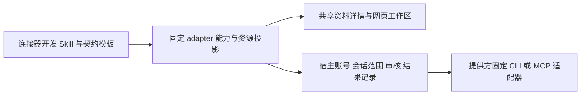

# Partner v0.1.0

> 本文件定义 Partner `v0.1.0` 的版本范围和 PF 设计。开发与集成状态以 [`FEATURE_LIST.md`](../FEATURE_LIST.md) 为准；Space 正式状态以 [`docs/FEATURE_LIST.md`](../../FEATURE_LIST.md) 为准。

## Release Scope and Compatibility

- Partner release target: `v0.1.0`
- Partner library target: `0.1.0`
- Space baseline: `v0.1.46-alpha.5`
- KodaX dependency: `0.7.96-beta.1`（以 `package-lock.json` 为准）
- Space mapping: `F146 <- PF001, PF002, PF003`
- Local connector foundation: PF004（Space 映射待集成时确定）
- Runtime boundary: Partner 继续作为 Space 的一个 surface，复用共享 KodaX Runtime；各 PF 不改变 Coder 的产品行为或权限。

现有 P1–P9 记录按可独立验收的接缝重整为三个 PF：P1–P3 属于 PF001，P4–P7 属于 PF002，P8–P9 属于 PF003。历史阶段、测试和评审证据继续保留在[详细开发计划](v0.1.61-partner-plugin-library.md)及[人工测试指南](../test-guides/FEATURE_146_v0.1.61_TEST_GUIDE.md)中。

## FEATURE_PF001: Partner Extension & Expert Library

### 1. 需求概述

在 Partner surface 上交付可独立安装、启用、禁用和卸载的 Extension，并通过该 Extension 提供预置专家和用户专家。用户可以为一段持久会话绑定一个专家、选择是否使用该专家配置的至多一个 Skill，并在后续轮次获得稳定、可追溯的专家行为。

PF001 只覆盖既有 P1–P3。它不包含连接器远端操作、平台原生资源交付或统一任务工作区，也不得修改 Coder 专属提示词、布局、daemon owner 或执行逻辑。

### 2. 影响范围

- 独立包与 manifest：`extensions/partner-library/**`
- Extension 生命周期宿主：`apps/desktop/electron/space-extensions/**`
- 专家目录与编辑界面：`apps/desktop/renderer/src/features/extensions/**`
- Partner 会话与专家快照：Partner session schema、store、runtime adapter 和相关 IPC/preload
- 共享边界：Extension host API、sandbox frame、CSP、打包脚本以及 Coder 非回归测试

用户专家数据与只读 Extension 包分开持久化；禁用、升级或卸载 Extension 不得静默丢失用户记录。

### 3. 技术方案

1. Extension 以 `.space-extension` 包交付，由可信宿主校验归档、manifest、路径、大小、兼容能力和调用来源；Extension frame 只获得受限消息接口。
2. 专家目录合并 Extension 预置专家和宿主持有的用户专家。预置记录只读；编辑预置专家会创建用户副本，删除用户专家采用软删除。
3. 前端只提交稳定专家引用；宿主解析当前 Extension 版本与 revision，形成不可变专家快照并随会话持久化。当前 Extension 不可用时拒绝新使用，旧快照不替代当前授权。
4. 一段会话至多绑定一个专家。选择、切换或移除只改变后续轮次，不覆盖草稿、不自动发送，也不把临时会话偷偷转为持久会话。
5. `useSkill` 明确控制是否采用专家声明的至多一个 Skill；原有独立 Skill 入口和执行优先级保持不变。

### 4. 接口契约

- Extension ID 保持 `kodax.partner-library`；Partner library 的 `v0.1.0` 发布产物必须在 manifest 与打包归档中声明版本 `0.1.0`。
- Host API 通过 `hostApiVersion` 与 `requiredHostCapabilities` 协商；显示版本号不授予宿主权限。
- 前端选择使用稳定的 `SpaceExpertRefT { extensionId, expertId, revision }`；只有宿主可以生成和持久化 `PartnerExpertSnapshotT`。
- 保存用户专家时，身份、revision、冲突检查和所有权由宿主决定；Renderer 不能指定可信用户身份。
- 专家绑定以 session 为归属，创建、恢复、fork、删除及 Extension 状态变化必须保持一致，并通过 typed IPC 传播。
- Extension frame 不得获得通用主 frame IPC、任意网络权限、凭据或文件系统能力。

### 5. 实现步骤

1. P1：完成独立 Extension 包、安装/启停/卸载/升级、受限视图与开发态/打包态兼容。
2. P2：完成首个专家、稳定引用与不可变快照、会话绑定、恢复/fork 及真实 runtime 注入路径。
3. P3：迁移预置专家，完成用户专家创建/编辑/软删除、可选 Skill 和目录竞态处理。
4. 以 [P1–P3 评审记录](F146-plugin-library-review.md)和测试指南 TC-001–TC-009 为已有证据，补齐真实模型重启、完整桌面循环、明暗/窄窗和目标平台打包验收。
5. 将 library manifest 与最终归档版本对齐到 `0.1.0`，再按 [`INTEGRATION.md`](../INTEGRATION.md) 记录进入 `Ready` 所需证据。

### 6. 验收标准

- Extension 可以安装、启用、禁用、卸载和重新安装；无包、坏包或不兼容包不阻止 Space/Coder 启动。
- 禁用或卸载后不能发起新的专家解析；重新安装后用户专家记录仍可恢复，旧会话不会串用错误 revision。
- 专家选择不会覆盖现有草稿或自动发送；多轮、双会话、恢复和 fork 使用预期快照。
- 预置专家只读，用户专家可安全创建、编辑和软删除；缺失 Skill 或 Extension 时给出真实降级状态。
- Extension sandbox、IPC sender、归档安全、类型检查、自动测试及 macOS 打包生命周期具有可复核证据。
- 真实模型重启、完整 Electron 开发态/打包态、目标布局及 Coder 回归完成后，才可把 PF001 标记为 `Completed`。

## FEATURE_PF002: Governed Connector Previews & Feishu Platform Expert

### 1. 需求概述

在 Partner 中提供受可信宿主管理的办公连接器预览和会话级授权。用户能识别各 provider 的真实可用状态，连接账号、选择会话资源范围、读取获准资料，并对支持的远端操作得到明确的执行或审核路径。

PF002 以飞书作为首个正式平台切片：交付飞书办公套件专家、持续但不自动发送的能力引导，以及受控的新建 Base 能力。它覆盖既有 P4–P7；其他 provider 的卡片、适配器或 fixture 只能按实际证据标为预览、不可用或待配置。

### 2. 影响范围

- Connector catalog 与声明：`extensions/partner-library/**`
- 可信连接器宿主：`apps/desktop/electron/partner-connectors/**`
- Partner connector runtime adapter：`apps/desktop/electron/kodax/partner-*`
- Renderer 连接、配置、资料和详情界面：`apps/desktop/renderer/src/features/partner/**` 与 `features/extensions/**`
- 共享接缝：connector IPC schema、preload allowlist、凭据与 CLI profile、浏览器安全和 Session 恢复/fork

账号凭据、CLI profile、资源正文和远端写入授权必须留在其所属可信边界，不进入 Extension frame、普通日志或模型上下文。

### 3. 技术方案

1. Extension 只声明 provider 元数据、能力和 UI；Electron 可信宿主持有 connector catalog、adapter、凭据、CLI、账号验证、权限检查和真实调用。
2. 账号连接、会话绑定和资源 scope 分成独立状态。每次读取或写入前重新校验 Extension 启用状态、连接 revision、账号、会话归属、scope hash 与操作权限。
3. Provider preview 必须展示真实状态：未安装、未登录、待配置、权限不足、被停用或尚无可执行 adapter 时不得伪装为已连接或可用。
4. 飞书读取只覆盖当前会话明确允许的文档。对既有资源的修改继续使用内容 hash 绑定的受审提案；拒绝、撤权、冲突、`unknown` 和 `partial` 均保留可解释结果且不自动重试。
5. 飞书办公套件专家通过同包 connector 引用和 `capabilityGuide` 提供两级任务引导；选择引导只更新草稿。受控 Base 新建由宿主解析账号和目录范围并返回可信官方资源身份。

### 4. 接口契约

- Connector、connection、account、session binding 和 resource scope 使用稳定 ID 与 revision；显示名称或模型参数不能推断授权。
- Renderer、Extension UI 和模型只能提出 schema 允许的请求；Electron 主进程是授权与副作用的最终 owner。
- Read contract 只返回会话 scope 内的受支持资源，并带 provider、账号/连接来源、资源 ID、canonical URL 和 revision 等 provenance。
- 对既有资源的 proposal 必须绑定目标、操作、完整内容或 patch、内容 hash 和基础 revision；apply 时重新验证 live authorization，不能复用过期确认。
- 新建 Base 只允许约定的低风险结构和获准目录；覆盖、删除、越权目录或高风险操作不因专家绑定而开放。
- `capabilityGuide`、专家 prompt 和 Skill 只提供任务引导，不授予 connector、账号、scope 或远端写入权限。

### 5. 实现步骤

1. P4：完成飞书账号验证、会话资源选择、限定读取、资料 provenance、恢复/fork 与撤销路径。
2. P5：完成既有资源受审写入、不可变审核内容、执行前重验和成功/失败/冲突/未知/部分成功记录。
3. P6：在真实 Electron 开发态与打包态完成安装、授权、读取、写入、禁用、卸载和回退验收，并单独记录 fixture 与真实服务证据。
4. P7：完成飞书办公套件专家、两级能力引导、受控 Base 创建和右侧官方资源打开。
5. 复用[飞书契约](f146-p4-p5-feishu.md)、[P4/P5 评审](F146-p4-p5-review.md)、[首次连接记录](f146-feishu-onboarding.md)和[多连接器评审](F146-multi-connectors-review.md)，补齐测试指南 TC-010–TC-038 中的真实服务与视觉项。

### 6. 验收标准

- 账号授权、会话授权和资源 scope 可以独立建立、切换和撤销；多账号、多会话之间不串联。
- 连接器预览准确表达可用性，未配置或未实现的 provider 不暴露可执行假象。
- 凭据、CLI profile 和主进程授权状态不进入 Renderer、Extension frame、模型上下文或普通日志。
- 读取仅覆盖获准资源；受审修改在拒绝、撤权、冲突、重复执行或不确定结果下保持安全且可追溯。
- 飞书专家不会自动发送或扩大权限；真实账号下的 TC-036 Base 创建能核对目录、标题、首表、字段和官方页面行为。
- 开发态、打包态、慢请求、窄窗、禁用/卸载及 Coder 非回归均有证据后，才可把 PF002 标记为 `Completed`。

## FEATURE_PF003: Receipt-First Delivery & Unified Workspace

### 1. 需求概述

对受支持的平台原生新建任务采用 receipt-first 交付：可信宿主一旦确认资源已创建并取得安全 canonical URL，就立即把资源作为任务产物交付；内容回读是否完全匹配作为独立校验状态，不得反向抹掉真实创建事实。

PF003 同时把任务过程、资料、网页资源、本地文件、Artifact、Skill 和专家汇入统一详情工作区，移除永久 Pending-review、Results 和办公用户终端等重复目的地。它覆盖既有 P8–P9，不扩大 PF002 的平台权限或 provider 可用范围。

### 2. 影响范围

- Provider-neutral document task、records 与 signal：connector IPC schema、store、service 和 Partner runtime adapter
- Partner 原生资源自动打开：`PartnerNativeDocumentAutoOpener` 及其去重和 hydration 逻辑
- 统一详情工作区：Partner workspace、任务卡、context rail、网页/文件/Artifact/Skill/专家详情路由
- 安全边界：canonical URL 校验、webview attachment、持久化且隔离的网页登录会话、历史记录迁移
- 非目标：Coder UI/Runtime、平台私有 URL 枚举、未获准 provider adapter 和既有资源的审核规则

### 3. 技术方案

1. 使用 provider-neutral `PartnerNativeDocumentTask` 表达一次新建请求，以稳定 invocation key、connection revision、scope hash 和规范化输入保证同一次 admitted turn 至多派发一次。
2. `status` 表达资源创建生命周期；只有可信回执能进入 `succeeded` 并携带 `resourceId`、`title`、无凭据 HTTPS `canonicalUrl` 和 `revision`。
3. `contentVerification` 与创建状态正交。`succeeded + unverified` 表示资源已创建但内容仍待核对，并携带用户可见 warning；异步回读成功后原位更新为 `verified`，不生成第二份产物。
4. 单调 records revision 和 task signal 驱动 Partner-only opener。只对本次 hydration 后的新成功转换打开一次；历史记录、失败状态和重复 signal 不重放。
5. 同一 provider/resource 复用一个隔离的右侧网页标签；任务卡和完整产物列表读取同一 records 来源。其他 typed detail 按资源类型进入统一工作区，不再维护重复的永久页面。

### 4. 接口契约

- Task `status` 只允许 `preparing`、`submitting`、`succeeded`、`failed`、`unknown`、`partial`；非 `succeeded` 状态不得暴露资源身份或校验状态。
- `succeeded` 必须同时携带 `resourceId`、`title`、`canonicalUrl` 和 `revision`；`canonicalUrl` 必须是无用户名、密码和本地协议的 HTTPS URL。
- `contentVerification` 只允许 `verified` 或 `unverified`；`unverified` 必须携带 `verificationWarning`，`verified` 不得遗留 warning。
- 创建回执和内容校验是双状态：可信创建成功即可进入聊天、任务产物和一次打开链；内容未验证必须明确提示，但不能把已创建资源降格成失败。
- Provider 私有 URL/resource 一致性由相应 adapter 校验；Partner 核心只消费已验证的 provider identity，不维护飞书、钉钉或腾讯文档枚举。
- Opener 只挂载在 Partner workspace；Coder 不消费 task signal。网页标签按 provider/resource 去重，HTTP、带凭据 URL、本地协议及不安全 attachment 一律拒绝。

### 5. 实现步骤

1. P8：建立 provider-neutral document task/store v2、URL 安全契约、Partner-only signal/opener、隔离网页登录会话和历史不重放。
2. P8：删除新建资源的旧 proposal/pending 路径；既有资源修改仍由 PF002 的审核链管理。
3. P9：用真实内容规范化差异固定回归，改为可信创建回执先交付、内容校验异步更新的双状态契约。
4. P9：把三张任务卡和网页、文件、Artifact、Skill、专家等 typed detail 路由到统一工作区，移除重复的 Results/Pending/Terminal 目的地。
5. 复用[详细开发计划的 P8–P9 记录](v0.1.61-partner-plugin-library.md)和测试指南 TC-039–TC-045 作为已有自动与草案证据；补充真实已连接环境下的新指令视觉验收。

### 6. 验收标准

- 可信创建回执到达后立即呈现唯一任务产物和 canonical URL；内容尚未验证时显示清晰 warning，但不冒充创建失败。
- 异步内容回读只能把同一任务更新为 `verified` 或保留 `unverified`，不得重复派发、重复产物或丢失真实资源链接。
- 派发前失败、派发后无可信回执、部分结果和未知结果保持可区分，并且不自动重试或伪装成功。
- 历史成功记录不在 hydration 时重放；新 signal 至多打开一次，同一 provider/resource 复用已有安全网页标签。
- 任务卡、完整产物列表及统一详情工作区共享同一 typed records 来源，网页、文件、Artifact、Skill 和专家能路由到正确详情。
- URL/webview 安全、旧 records 迁移、Partner-only ownership、真实连接视觉闭环和 Coder 非回归均有证据后，才可把 PF003 标记为 `Completed`。

## FEATURE_PF004: Shared Connector Capabilities & Builder Methodology

### 1. 需求概述

新增服务时复用连接器开发方法与宿主交互，避免复制飞书页面、授权系统和右侧工作区。把“服务支持什么”“资源是什么”“用什么方式查看”和“本次是否有权执行”分别表达。

本次建设公共能力，不新增具体 provider。现有 Feishu 文档、Notion 页面、Airtable 表是三个已实现的读取契约实例，可共同验证资源展示；只有飞书有用户实际使用与测试证据，其余仍保留预览/待实测定位。

### 2. 影响范围

- `packages/space-ipc-schema/src/partner-connector-capabilities.ts`：固定能力声明与资源展示投影。
- `apps/desktop/renderer/src/features/extensions/`：配置和创建交互读取公共能力声明。
- `apps/desktop/renderer/src/features/partner/`：资料详情、列表到详情路由、网页标签复用。
- `features/partner/partnerLinkEvents.ts`、`partnerLinkDetails.ts`、聊天 Markdown 与 Shell：Partner 对话链接进入共享右侧工作区，Coder 保持现有行为。
- Codex 开发 Skill `space-connector-builder`：更新主入口、宿主/交互参考和提供方接入模板。Skill 安装在用户的 Codex 技能目录，不写入 Space 共享 Skill 库。

不迁移数据库，不新增通用远端执行 IPC，也不扩张已实现 provider 的写入范围。

### 3. 技术方案

使用三层组合：

1. **能力声明**：由代码中的固定 adapter registry 描述当前已实现操作。Manifest 引用已知 adapter，不能提交脚本、任意命令或任意能力来获得权限。账号授权、会话范围与宿主策略仍是执行时判断的依据。
2. **资源与网页分开**：继续使用已有严格资源校验和稳定资源键。`notion://`、`airtable://` 等内部引用保留身份用途；只有合法网页地址才提供浏览器入口，不为内部 scheme 放宽浏览器策略，也不猜测分享地址。
3. **资料详情共享**：资料条目进入稳定 source ID 对应的本地快照详情。复用按项目/会话过滤的 `sources.get`；标题、来源、revision 和正文来自宿主记录。查看详情不重新调用远端、不安装组件、不登录。原账号断开不阻止已有快照显示，旧快照不授予新执行权限。
4. **链接交互共享**：Partner 对话中的 HTTP(S) 链接经统一事件进入当前会话右侧浏览器；卡片与资料使用同一工作区。明确“外部打开”仍交给系统浏览器；Coder 不改变链接行为。资源内容仍按既有受控浏览器/Markdown 规则展示。
5. **已有操作继续复用**：读取沿用共用 sources；已有文档追加沿用不可变 proposal 与审核；创建沿用 document/Base task 与可信回执。本次抽出支持范围供 UI 使用，保留飞书专属 payload 和执行器，不把不同写入操作强行统一。
6. **开发方法沉淀**：Skill 区分接入服务、修复服务和公共能力建设；提供官方证据、资源/操作契约、最小代码变更接缝与分层验收模板。后续开发先选择现有接缝，仅补提供方差异及其测试。

### 4. 接口契约

- 能力声明只表达当前代码支持，不表达已连接、权限充足或真实服务已验收。只有受信任 adapter 的已有操作可被呈现为支持项。
- 资源投影包含 adapter、资源种类、原始规范引用、稳定资源键和可选网页地址；严格验证失败时不能得到被信任的资源动作。
- 资料打开目标为 `remoteSource` 与 `sourceId/title`；标签去重使用稳定 source ID，读取归属来自当前项目和会话。切换后迟到响应必须丢弃。
- 浏览器目标与远端资源身份分离。URL 打开不增加 connector scope，不替代账号授权，不触发 connector 写入。
- 聊天打开事件携带当时的项目/会话上下文，Shell 只消费与当前 Partner 上下文一致的事件。显式外部打开不能回流到内部浏览器。
- 无需更改历史 source、proposal 或 task 记录；已有 Feishu 成果、Base 状态与追加审核继续可发现、可查看。

### 5. 实现步骤

1. 先以 Feishu/Notion/Airtable 的资源类型、非法地址与现有操作集合写失败测试，再实现共享声明与投影。
2. 以资料→指定快照→右侧详情和 Partner 聊天→网页标签为用户切片做失败测试；接入现有工作区、错误重试与上下文隔离。
3. 更新开发 Skill 和接入契约模板；使用独立 agent 在隔离输出目录执行真实情境的 forward test。
4. 执行相关回归、完整测试、类型/lint、主应用与独立 Extension 构建；验证 Electron 中的共享交互，并记录模拟与真实服务边界。
5. 独立评审新改动，保留上一轮飞书修复和无关用户改动；仅在本地验收完成后更新 PF004 状态。

### 6. 验收标准

本地验收已完成，实施与验证见 [PF004 验收记录](PF004-shared-connector-validation.md)。

- 三种既有来源都能打开正确的本地正文；内部引用不再进入空白浏览器。
- Partner 对话网页、资料网页入口与现有成果链接共用右侧工作区；Coder 和显式外部打开仍走原行为。
- 资源投影拒绝错配 adapter、伪造域名、凭据 URL 和不支持的引用；不放宽浏览器/CSP/IPC 边界。
- 快照加载失败可重试，会话切换后不会展示另一会话的迟到结果；打开快照零远端调用。
- 只读 adapter 不显示未实现的创建/追加操作；飞书范围加载保护、创建成果和完整追加审核回归通过。
- Skill 可正常发现、结构校验通过，独立使用者能找到真实代码接缝并产出有证据等级的接入计划；不要求公共能力任务先指定 provider。
- 自动测试、构建与 Electron 证据可复核；不把其他 provider fixture 标记为真实账号测试，不更新 Space 集成或发布状态。

## FEATURE_PF005: Tencent Docs & Personal Mail Connectors

### 1. 需求概述

用户选择先开发腾讯文档、网易邮箱和 QQ 邮箱。复用 PF004 开发方法与公共交互，使三家从目录、可信授权、会话范围到资料/成果详情形成完整首批能力。网易仅支持个人 163，QQ 仅个人 qq.com，暂不扩展别名、企业邮箱或其他网易域名。

### 2. 影响范围

- `extensions/partner-library` 目录、独立 HTML、官方品牌资源。
- `space-ipc-schema` adapter、邮件资源/范围、搜索、临时可信输入契约。
- `electron/partner-connectors` 官方腾讯文档 MCP 与共享 IMAP/MIME 实现、持久任务、凭据和撤权。
- Partner run 工具、IPC sender 校验、连接窗口、会话详情、收件箱搜索与右侧源资料。
- 仅新增依赖 ImapFlow、mailparser、html-to-text 及类型；复用系统 Keychain 和已有 Artifact。

### 3. 技术方案

腾讯文档使用官方固定端点与工具白名单，显式完成网页授权后交换令牌；不运行官方 setup.sh、不安装全局 mcporter。令牌进入 Keychain；账号显示“腾讯文档授权连接”，使用凭据摘要绑定身份，不能冒充经过验证的 QQ/微信昵称。通过受保护端点核验有效性。首批支持指定 `/doc/` 文字文档完整读取及个人首页新建 Markdown 文档；新建结果沿用共享持久任务、提交门、未知结果不重试和真实网页回执。创建回执不等于内容回读验证。

两家邮箱共享 ImapFlow TLS IMAP + mailparser MIME 处理，固定官方 `imap.163.com:993` / `imap.qq.com:993`。授权码只在可信主窗口临时表单输入并交到宿主安全存储；不向插件 frame、模型或日志暴露。登录、只读 EXAMINE、UID 搜索及 BODY.PEEK 读取均限 INBOX，无 SMTP、删除、移信、设置已读或服务器草稿命令。HTML 邮件转纯文本，附件仅展示元数据，整体 MIME 上限 2 MiB、正文 128 KiB，超限失败而非静默截断。

### 4. 接口契约

- IDs/adapters：`tencent-docs` / `tencent-docs-mcp`，`netease-mail` / `netease-mail-imap`，`qq-mail` / `qq-mail-imap`。
- 邮件引用为 `mail://netease/inbox/<UIDVALIDITY>/<UID>` 或 `mail://qq/inbox/<UIDVALIDITY>/<UID>`；两个 ID 均为有效非零 uint32。内部引用不拼接成网页登录 URL。
- Binding 明确选择 `mailbox: 'inbox'` 或腾讯文档 `allowCreateDocument: true`；这些字段参与 scope hash，跨服务、跨会话和撤销时拒绝。
- 搜索单次覆盖至多 500 个 UID 位置，每页至多 25 个结果；`nextCursor` 显式继续到更早窗口。返回范围与 hasMore，不把一页宣称为全邮箱。搜索只返回头信息，正文通过单独 read 保存到共享 source。
- 新增 `partner.connectors.onboarding.submit` 只接受主 frame 当前任务所需输入、所有权与一次消费；取消、到期和结束清理临时输入。业务搜索同样只走可信 IPC。
- `partner_connector_search` / `partner_connector_read` 按 run scope 开放；`partner_connector_document_create` 使用显式腾讯文档创建范围和宿主 turn ID。计划模式禁写。
- 用户要求回复时复用已有 `create_artifact` 生成本地 Markdown 草稿，含收件人、主题、正文和源引用；不表示已发送或保存到邮箱服务器。

### 5. 实现步骤

1. 固定官方来源和首批边界；保留先前飞书/PF004 本地改动基线。
2. schema 与可信临时输入、provider fixture、会话/提交门、run 工具分别先写失败测试再实现。
3. 三张新目录卡、可信连接流程、会话范围、搜索/读取与共享详情接线；真实第三方品牌资产随包提供。
4. 覆盖跨账号、取消、撤权、迟到响应、分页、MIME、过大数据、持久写入去重和 unknown；完成类型/lint、全套测试、独立插件构建与隔离 Electron 验证。
5. 保存可复用方法、验收证据和真实账号测试步骤。实际第三方授权/数据读写由用户账号下一步验证，不把 fixture 算作实测。

### 6. 验收标准

- 三家可见且首批边界准确，完成连接流程到可选择会话范围；不伪造已登录。
- Mail 凭据不进入公共 job/source/模型/日志；查询和正文读取不改变邮箱状态；分页与超限解释准确。
- Mail source 可进入共享右栏；生成本地回复 Artifact 可预览/修改；无误发邮件入口。
- 腾讯文档读/新建固定官方工具，授权和 live scope 守卫有效；unknown 不重试、成功回执可在共享右栏打开。
- 自动测试、类型、lint、构建和隔离桌面流程通过；真实账号未验证项明确列出。
- `Completed / Local` 仅表示首批代码及本地自动验收完成，不等于已发布或三家真实账号已验收。

## FEATURE_PF006: Slack, Zoom & GitHub Read Connectors

### 1. 需求概述

将 Slack、Zoom 两个目录占位实现为可配置的读取连接器，并增加 GitHub。首片提供 Slack 单条消息、Zoom 会议基本信息、GitHub 仓库说明与默认分支 README、指定 Issue/PR 正文。使用共享开发 Skill 与 PF004 右栏，不新增执行引擎。

### 2. 影响范围

固定 adapter/资源 schema、可信 onboarding input broker、主进程凭据生命周期、三个官方 API 实现、目录与配置弹窗。GitHub 为 `github-api`；Slack/Zoom 保留既有 `slack-mcp`/`zoom-mcp` 存储 ID，但实际传输为官方 REST，界面不宣称 MCP 或产品方的一键 OAuth。13 个目录项均有基础操作实现；实现不等于真实账号验收。

### 3. 技术方案

共享 `api-credential-connector` 仅处理输入、凭据校验/保存、身份复验、取消与本地删除；共享 `api-http` 仅处理固定官方主机、30 秒超时、1 MiB 流式上限、拒绝重定向与安全错误。提供方保留固定只读路由，业务请求必须在真实 service 的 `beforeRead/assertRead` 检查之后分派。

- Slack：安装自有 Slack App，使用 Bot/User OAuth Token；`auth.test` 校验工作区与用户，返回 scopes 时检查至少一项历史读取权限，实际读取仍由 API 校验频道权限。指定消息使用 `conversations.history latest=<ts>&inclusive=true&limit=1` 并核对精确 ts，Bot 需加入频道。无搜索、线程或发送。
- Zoom：管理员创建启用 Server-to-Server OAuth App，填写 Account ID、Client ID、Client Secret；固定 token 交换验证账号/应用与 meeting 管理员读取 scope，固定 GET meeting。临时 access token 不落盘；无录制、转录、参会者或创建会议。
- GitHub：个人访问令牌，建议 Fine-grained PAT 限定仓库与 Contents/Issues/Pull requests 只读权限；组织可能需要批准。`/user` 绑定不可变 user ID，REST API version 固定 `2026-03-10`。仓库 GET 后只读取默认 README；404 明示不可用，不把其余错误当成功。Issue/PR 不读取评论、diff 或关联资源。

### 4. 接口契约

`slack_token`/`github_token` 使用 `{token}`，`zoom_account` 使用 `{accountId,clientId,clientSecret}`。只经宿主 IPC 临时输入，不进插件页面、任务状态、模型或本地业务数据库。撤销在本地删除凭据并使会话绑定失效，不远程撤销用户自有应用。

资源为严格 HTTPS 消息/会议/仓库/Issue/PR 链接（无查询、片段和凭据），兼容既有 Slack/Zoom internal ref。只有 HTTPS 投影可打开网页；internal ref 只显示本地快照。Zoom 的 `start_url`、密码和带密码的入会链接不存入快照。新链接不授予读取权限，网页登录与连接器账号独立。

### 5. 实现步骤

1. 测试先行扩展资源与可信输入契约。
2. 三个固定 API adapter 与共享凭据/传输接缝，真实 adapter→service→store 的模拟 transport 验证。
3. 可信密码表单、目录注册、共享右栏与离线品牌；替换旧占位测试。
4. 全量回归、类型/lint/构建、隔离打包 Electron、独立 forward-test，保存提供方未实测边界。

### 6. 验收标准

[实现与验收记录](PF006-slack-zoom-github-validation.md)。

三个连接入口可用且准确说明前提；选择资源后经会话授权读取为持久化快照，网页进入共享右栏；无错误资源替代、跨会话读取、撤销后的迟到结果落库、凭据泄漏或隐式写入。自动化与 Electron fixture 完成后记 `Completed / Local`，真实服务仍由用户授权后逐项验收，不把目录项当成已实测。

## FEATURE_PF007: Composable Experts & Shared Connector Guidance

### 1. 需求概述

用户确认：保留岗位与任务两个发现入口，取消平台专家分类；服务接入与操作引导归连接器，工作方法归 Skill，专家提供专业判断与完整交付。首先完成产品管理、深度研究两个样板，复用已有资料与成果右栏。

用户进一步明确：专家作为当前对话持续绑定的配置包，由同一个 Partner Agent 在后续对话与任务中持续使用，直至用户切换或移除。岗位和任务专家共用这一生命周期；本轮不以独立 Agent、小队或复杂 Skill 编排作为完善目标。详细约定见 [会话持续绑定](EXPERT_BUILDER.md#会话持续绑定)。

### 2. 影响范围

专家 schema/catalog、Partner profile、插件目录/编辑器/专家详情、会话输入框连接器引导、内置第一方 Skill 源及锁定快照。保留既有账号授权、执行引擎、工具、不可变专家快照及独立 Skill 优先级。历史飞书专家可以继续使用，新目录不再推荐；用户副本不删除。无新增 provider 操作、专家团执行器或远端发布。

### 3. 技术方案

- 为专家增加可选结构化 workflow：必要资料、交付物、质量检查、连接器操作需求及必需/可选说明；投影到详情和真实 SDK profile/verification，而非仅展示文案。
- 复用现有一个可选 Skill 引用及用户关闭/显式指定 Skill 的语义。每个样板一个完整方法 Skill，使用共享内置注册与打包，不另建安装器或改变 SDK。
- 专家目录退役标记只阻止新绑定；历史 snapshot 的 prompt/revision 继续保留。岗位/任务仍为同一运行机制的发现分类；历史 platform 用户副本在岗位入口中兼容展示与编辑。
- 按现有已实现操作生成共享连接器引导，只有当前会话绑定、可用且已启用的连接器显示；点击只插入草稿，不发送、不授权。支持飞书、腾讯文档、邮箱以及其余只读服务；方法与原生交付遵从既有 host policy。
- 结构化能力需求不授予权限；详情明确必需/可选，执行上下文要求先检查当前工具，缺失时保留目标并引导补齐。样板的远端服务需求为可选，允许本地资料任务。
- 新契约通过显式 host capability 握手，旧 manifest 与历史快照继续解析；新包不能在不支持该契约的旧 host 上静默运行。

### 4. 接口契约

测试接缝来自用户已确认的方案：严格 schema + 安装/目录/解析；SDK profile 与显式 Skill 执行；真实 Renderer 的目录/详情/连接器引导；现有 run-scoped connector 工具、来源快照、创建回执及右栏。状态只能由宿主确定，专家文本/元数据不代表账户或资源授权。

### 5. 实现步骤

1. T1：先验证退役专家的旧快照和新目录行为，再实现 schema、catalog、编辑兼容及 host 握手。
2. T2：将连接器引导接入输入框与连接器详情，验证无专家也能使用、不同服务能力正确、会话切换无旧选择、点击不发送。
3. T3：增加两个专家的工作契约与第一方 Skill，接入 profile/verification、用户副本编辑及详情；验证缺失 Skill 与用户关闭/显式 Skill 的既有行为。
4. T4：验证相同样板跨飞书/腾讯文档的读取、交付回执与资料详情；保存模拟 transport 与真实桌面证据，真实账号验收单列。
5. T5：沉淀专家开发规范；完成双轴评审、适当覆盖率、全量测试、类型/lint/构建及隔离桌面验收。

### 6. 验收标准

本地验收已完成，状态 `Completed / Local`。详见 [PF007 验收记录](PF007-expert-workflows-validation.md) 与 [专家开发方法](EXPERT_BUILDER.md)。

- 新目录展示 9 个预置专家，只提供岗位/任务选择；飞书历史绑定与用户副本可恢复，不静默改写 prompt。
- 连接器引导按实际操作展示，任意专家或未选专家都能使用；不自动发送、扩权或发起远端读写。
- 产品管理/深度研究提供可检查工作契约、独立方法 Skill 与成果要求；真实 SDK 上下文含方法与校验要求。
- 同一专家跨已支持的连接器可读取指定资料并交付到指定平台；来源与回执复用现有右栏，失败不冒充成功。
- 通过回归与独立评审；真实 provider 账号未验证时明确记录。完成状态只代表 Partner 本地交付。

## FEATURE_PF008: Persistent Expert Conversations

### 1. 需求概述

用户要求按会话持续挂载专家：同一个 Partner Agent 在后续对话与任务中持续使用专家的角色、方法和交付标准，直至用户切换或移除。岗位与任务专家共用生命周期。关闭默认方法或临时调用其他 Skill 不清除专家；新会话独立选择，恢复原会话保持原配置。

### 2. 影响范围

复用已存在的每轮 profile/Skill 注入、会话运行配置持久化、宿主恢复、变更提交及排队执行。补充模型的会话持续性规则、输入框和详情说明，并验证实际产品管理与深度研究定义；按验证发现修正实际缺口。无需增加专家实例调度、独立记忆、连接器操作或多 Skill 引擎。

### 3. 技术方案

专家配置仍为不可变会话快照，每次新运行读取当前已提交配置。模型明确承接同一会话已有事实和决策，后续提问只更新任务；按当前任务规模使用方法，避免每条简短回复都重复产出整份报告。输入框持续展示绑定身份与生命周期，加载/不可用时准确显示状态。切换或移除只影响后续运行，已有执行、历史资料与成果保留。

### 4. 接口契约

沿用户已确认的公开接缝验证：真实 `session.partnerExpert.get/set` 与 host 持久化/恢复；`RealKodaXSession.send` 实际 SDK 模型上下文；真实 Renderer 专家绑定与右侧详情。默认 Skill 逐轮应用，用户显式 Skill 只覆盖该次方法，连接器沿原会话权限提供。任务专家不因任务完成自动退出。

### 5. 实现步骤

1. 写失败用例验证模型持续会话规则及界面上的绑定说明，再补充现有 profile 和 UI。
2. 使用两个实际内置样板，完成多轮任务、临时 Skill、默认方法关闭/恢复、专家切换/移除、宿主恢复与第二会话隔离验证；出现缺口时先固化失败再修复。
3. 运行相关运行/持久化/UI 回归、类型/lint 和应用构建；在隔离 Electron 验证绑定状态、恢复及操作后果。
4. 双轴评审本轮增量、保存验收证据；仅在本地完成后记录 Completed / Local。

### 6. 验收标准

- 输入框与详情明确说明专家适用于本会话后续对话和任务，状态变化可见，旧详情不冒充当前绑定。
- 两个样板在多个连续任务和恢复之后的实际 SDK 上下文都包含正确专家与选定方法；临时 Skill 不改变后续角色。
- 更换专家与移除会更新后续运行，默认 Skill 开关持久化；另一会话不受影响，已有历史/资料不丢失。
- 排队运行及执行中变更遵循已提交配置边界，不因为提示词包而授予额外权限。
- 回归、构建、评审和隔离桌面通过；控制模型的链路验证与真实模型专业质量评价分开报告。

2026-09-07 本地完成，状态 `Completed / Local`。实际两个样板多轮、真实 Host/SDK 恢复和会话隔离通过；全量 4,027 PASS / 4 平台跳过，评审修复后相关 22 项 UI 回归通过。macOS arm64 新打包应用隔离验收通过；未发布或合入 Space。见 [PF008 验收记录](PF008-persistent-expert-validation.md)。

## FEATURE_PF009: Reusable Expert Catalog Expansion

### 1. 需求概述

扩充可持续挂载的岗位与任务专家。优先引入现成开源方法，不恢复缺少方法与验收的占位卡片。用户补充要求检查 WorkBuddy / 豆包工作可直接复用的 Skill 和专家。

### 2. 影响范围

Partner library 专家 manifest、内置 Skill 源及锁定快照、目录打包和真实 SDK 验证、专家开发方法。保留原有专家历史快照和用户副本。

### 3. 技术方案

候选项目管理、用户研究、内容写作、数据分析、会议整理、商务沟通。现成方法优先追溯作者仓库、明确许可并锁定 Git revision；与会话和工具相关的适配保存为补丁。没有可直接复用的方法再编写小范围自有方法。

### 4. 接口契约

沿用 host API v4、expertType role/task、skillRef、workflow；所有新能力复用已有执行器、Skill 优先级和交付右栏。方法或行为修改递增 revision，退役定义不删除。外部操作仍由实际授权与工具决定。

### 5. 实现步骤

1. 记录研究来源、复用判断和工作区基线。
2. 先验证目录与真实 Skill 发现，再实现完整专家和方法。
3. 验证多轮上下文注入、历史兼容和可交付样板，检查依赖与资源完整性。
4. 完成适当构建与隔离桌面验证，记录模型质量与接线测试的边界。

### 6. 验收标准

- 新专家有真实可加载的方法、明确输入和检查标准，目录没有空位。
- 复用材料保留作者许可与版本，缺失工具或可选 Skill 不阻断基础任务。
- 原两个专家、历史会话和用户副本保留。
- 测试和构建证据可复查，未验证的真实模型/账号能力不冒充通过。

状态：Completed / Local。验收见 [PF009 专家扩展记录](PF009-expert-expansion-validation.md)。

## FEATURE_PF010: Office Expert Research & Reuse

### 1. 需求概述
梳理两家办公专家及现有覆盖，优先复用可追溯的提示词/Skill，找不到适用来源时再用 Skill Creator 自建。

### 2. 影响范围
Partner 专家 manifest、随包 Skill 来源与适配、既有目录/SDK 接缝测试及 Partner 文档。

### 3. 技术方案
复用 Anthropic knowledge-work-plugins 的 process-doc、draft-response、knowledge-synthesis、status-report，建立流程与SOP、客户支持、资料综合与知识整理、工作汇报四个专家。保留原作者与 Apache-2.0 许可并锁定 Git commit；用补丁适配会话权限、事实与交付边界。

### 4. 接口契约
沿用 host API v4 的 expert/workflow/skillRef。四个新 ID，revision 1；不修改既有专家、连接器权限或运行器。岗位与任务均持续绑定会话。

### 5. 实现步骤
调研并去重；新增目录/实际 SDK 样板测试并确认失败；登记来源及适配；同步并检查锁文件；验证真实模型任务与桌面流程。

### 6. 验收标准
四个方法可发现且完整进入模型上下文；持续会话、恢复、开关有效；输出保留未批准/未知/冲突事实；许可与固定版本可追溯；桌面显示十二个可用专家。验收完成：65项独立定向测试、最终方法/提示修正复测、类型/lint/构建及12专家隔离Electron通过；四个真实模型基本样板完成，复杂业务质量边界见 [PF010验收](PF010-office-expert-validation.md)。状态 Completed / Local，未发布。

## FEATURE_PF011: Expert Portraits & Browsable Profiles

### 1. 需求概述
参考用户截图的 WorkBuddy 专家和现有连接器卡片，先设计十几至二十枚头像；卡片直观清爽，详情解释清楚专家能力。

### 2. 影响范围
独立 Partner 插件UI与打包、共享专家展示元数据、头像静态资源、会话右侧详情、既有UI测试与Partner文档。

### 3. 技术方案
生成16枚原创插画头像，12枚映射现有专家、4枚留作复用。卡片采用两列自适应布局，显示头像/名称/领域/说明/三个能力标签，整卡只有查看详情入口。详情用原生dialog聚焦任务示例、交付成果、所需资料、质量检查与工作方法；单个使用按钮和可选方法开关，编辑/删除/提示词归入展开区。右侧会话详情共享头像及展示信息。

### 4. 接口契约
继续使用既有 expert.select/details/save/delete 与不可变revision；不改专家行为定义或增加权限。头像静态资源同时供宿主和构建时嵌入插件，保持独立归档两文件与2MB上限。默认方法开关仍通过useSkill传递；浏览详情不选专家、不修改草稿、不发送消息。

### 5. 实现步骤
保存基线；生成并检查16头像；更新卡片和详情；验证选择/开关/编辑/删除、键盘与窄屏；类型/lint/构建；打包Electron验证并更新本机插件。

### 6. 验收标准
所有现有专家有正确头像与能力说明；头像离线可加载；卡片操作收敛、详情层次清晰；关闭详情恢复焦点；小屏不横向溢出；原有专家选择/副本/删除确认/会话恢复语义保持。

验收完成：22项定向测试、类型/lint/构建、macOS arm64打包及12专家隔离Electron验证通过。16原创头像已生成，12枚应用、4枚储备；本机插件已更新。状态 Completed / Local，未发布。见 [PF011 验收与素材](PF011-expert-presentation-validation.md)。

## FEATURE_PF012: Partner Cold-start Home

### 1. 需求概述
用户希望默认冷启动页面参考 WorkBuddy。设计任务优先的首页，提供清晰起步方式。

### 2. 影响范围
PartnerWelcome、PartnerConversation、PartnerWorkspace及中英文本。保留现有输入框和会话执行机制。

### 3. 技术方案
居中欢迎语、真实输入框、专家与资料辅助入口、六个办公任务示例。无会话时默认隐藏空任务栏，用户仍可主动打开；开始会话后沿用任务栏偏好。采用已有头像与配色，不添加虚构成果或使用次数。

### 4. 接口契约
任务入口按用户后续确认关联真实专家：读取已启用插件的当前目录，先用现有binding.select挂载对应revision与默认方法，再调用既有事件插入专家starterTask，不自动发送。卡片展示对应专家和实际交付说明；不可用时禁用。专家管理入口走既有管理事件，资料走既有选择器。BottomBar保持同一组件位置，首次创建会话不重挂载。

### 5. 实现步骤
确认当前首页及官方参考；复用现有接缝实现；检查无项目、草稿、入口及会话切换；构建并在隔离桌面检查视觉。

### 6. 验收标准
首页六个示例可用、输入框状态保留、专家和资料入口可达、首次发送正常进入会话、窄窗口可滚动、既有会话与运行不受影响。

2026-09-08 Completed / Local：真实隔离Electron验证六示例、草稿保留、专家引用头像、首次发送及窄窗口；类型/lint通过。7项相关测试通过，1项既有SSR测试失败（改动前同样失败），打包包装器的安装器检查不适用于本次dir产物。见 [PF012记录](PF012-home-validation.md)。

## FEATURE_PF013: Sales, Hiring, Onboarding & Presentations

### 1. 需求概述
用户希望增加更多完整专家，沿办公场景继续扩充，保留角色加方法Skill的持续会话模型。

### 2. 影响范围
Partner目录新增四个独立ID，三份开源方法适配与锁定快照，展示元数据，真实SDK接缝测试及验证材料。旧专家和历史版本保留。

### 3. 技术方案
销售拜访顾问复用call-prep，招聘面试设计复用interview-prep，新员工入职复用onboarding，演示文稿制作复用已有frontend-slides。使用sales/hr/training/presentation四个储备头像。HTML演示不冒称原生PPTX，外部动作只沿既有授权。

### 4. 接口契约
新增专家均revision 1，role两位、task两位；沿现有expert/workflow/skillRef、会话绑定和目录详情。开源方法固定版本、许可与适配补丁通过既有同步器锁定，不复制执行器，不增加权限。

### 5. 实现步骤
核对候选和来源；新增目录断言确认缺失；适配方法、创建完整专家；同步方法；实际SDK、真实模型样板和隔离桌面验证；更新本机插件与打包。

### 6. 验收标准
目录16位专家且没有新占位；四个方法进入真实SDK并在恢复后继续生效；角色输入、交付、检查、头像完整；样板明确未知、授权和格式边界；许可与来源可追溯。本地实现与接线验收完成；真实模型样板的修复、复测和剩余质量局限见 [PF013验收](PF013-expert-expansion-validation.md)。本机插件已更新，开发版前端已启动。
